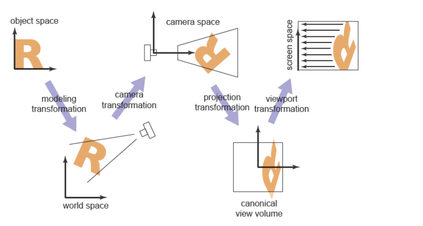
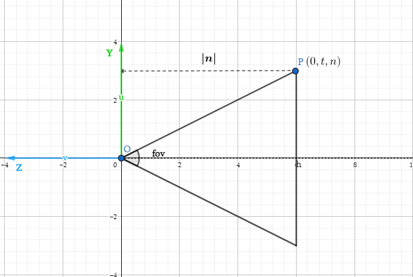

# 图形学的数学基础（六）：mvp变换
图形学的一个重要任务是将三维空间中的模型映射到二维平面(以像素为单位)，这是一个复杂的过程，取决于许多因素，包括但不限于相机的位置，方向，投影的类型（正交/透视），fov，和viewport宽高，对于所有复杂的矩阵变换，最好的做法是将其分解为几个更简单的矩阵乘积。大多数图形系统通过使用四个转换序列来实现mvp变换,以openGL为例：

1. **worldMatrix**：将视图从模型空间转换到世界空间。直白的说就是将模型摆放到世界坐标空间。这一步确立了世界空间中各模型的相对布局，摆放位置。
   
2. **viewMatrix**：将视图从世界空间转换到相机空间。简单来讲就是：我们从何处，以什么样的视角观察世界。
   
3. **Projection**：将视图从相机空间映射到$[-１,１]^３$，的单位立方体中，为下一步viewport变换做准备。
   
4. **viewport**: 将视图从单位立方体映射到所需的屏幕空间（$screenSpace$），取决于输出图像的大小和位置。
   

## 视图变换
现实生活中，如果相机和所有物体一起移动（相对位置关系不变），则拍出来的照片也都是一样的。根据这个原理我们得出：将相机移动到原点，朝向-z方向，构造出一个变换矩阵$\textbf{M}_{view}$，其他物体随着相机一起移动（应用$\textbf{M}_{view}$）。即可完成viewTransform。如何构造$\textbf{M}_{view}$？将视图从世界空间转换到相机空间？首先需要定义相机参数：

- 位置（eye Position）：$\mathbf{e}$
- 观测方向（gaze Direction）：$\vec{g}$
- 向上方向（up Direction）：$\vec{t}$

根据这些信息，我们可以构造一个以$\mathbf{e}$为原点的uvw标准正交基。

- 向量正交化
- 将$\mathbf{e}$移动到原点
- 旋转$\vec{g}$ 到-z方向
- 旋转$\vec{t}$到y方向
- 旋转$\vec{g}\times \vec{t}$到x方向。
  
因此我们可以将$\textbf{M}_{view}$拆解成平移和旋转两个部分.首先需要对相机参数的向量正交化。

$\textbf{M}_{view}$ = $\textbf{R}_{view}$$\textbf{T}_{view}$

### 正交化

根据前边章节讲过的矢量叉乘正交化的方法，可以计算出：

$\hat{w} = -\dfrac{\vec{g}}{||g||}$

$\hat{u} = \dfrac{\mathbf{t}\times \mathbf{w}}{||\mathbf{t}\times \mathbf{w}||}$

$\hat{v} = \mathbf{w}\times \mathbf{u}$

### 平移矩阵

$\textbf{T}_{view}$ = $\begin{bmatrix}
    1&0&0&-x_{e}\\ 
    0&1&0&-y_{e}\\ 
    0&0&1&-z_{e}\\ 
    0&0&0&1\\ 
\end{bmatrix}$

### 旋转矩阵

旋转矩阵不好写，但是我们可以反过来思考这个问题，将x（1，0，0），y（0，1，0），z（0，0，1）分别旋转到$\hat{u}$,$\hat{v}$, $-\hat{w}$是很好写的，由于这两个矩阵互为逆矩阵，根据旋转矩阵的性质，旋转矩阵都是正交的，而正交矩阵的逆矩阵等于其转置。所以我们可以先求$\textbf{R}_{view}$的逆矩阵，然后将其转置，即可得到$\textbf{R}_{view}$：

$\textbf{R}_{view}^{-1}$ = $\begin{bmatrix}
    x_u&x_v&x_w&0\\ 
    y_u&y_v&y_w&0\\ 
    z_u&z_v&z_w&0\\ 
    0&0&0&1\\ 
\end{bmatrix}$

$\textbf{R}_{view}$ = $\begin{bmatrix}
    x_u&y_u&z_u&0\\ 
    x_v&y_v&z_v&0\\ 
    x_w&y_w&z_w&0\\ 
    0&0&0&1\\ 
\end{bmatrix}$

### 合到一起

$\textbf{M}_{view} = \textbf{R}_{view}\textbf{T}_{view} = \begin{bmatrix}
    x_u&y_u&z_u&0\\ 
    x_v&y_v&z_v&0\\ 
    x_w&y_w&z_w&0\\ 
    0&0&0&1\\ 
\end{bmatrix}\begin{bmatrix}
    1&0&0&-x_{e}\\ 
    0&1&0&-y_{e}\\ 
    0&0&1&-z_{e}\\ 
    0&0&0&1\\ 
\end{bmatrix}$

## 投影变换
接下来我们实现mvp变换中的投影变换（$projection Transform$和视口变换($viewport)，投影变换有两种方式，分为正交投影（$Orthographic projection$）和透视投影（$perspective projection$）.两种投影方式最终都将视锥体内的物体投影到近平面上（将视图从相机空间映射到$[-１,１]^３$的标准立方体中），也是3D空间映射到2D屏幕空间最为关键的一步，如下图所示：

### 正交投影（$Orthographic projection$）

正交投影会保持几何图元相对位置关系不变，平行的线永远平行。不满足透视关系。又叫做平行投影。
正交投影的视锥体是一个长方形，由top bottom left right near far6个参数定义。如下图所示：

如何将该长方体映射到$[-1,1]^3$呢?和$\textbf{M}_{view}$类似,我们先将立方体中心移动到原地,然后根据每个方向的长度,缩放到[-1,1]之间.即$\textbf{M}_{scale}$$\textbf{M}_{translate}$.需要一次平移变换 + 一次缩放变换.

#### $\textbf{M}_{translate}$平移矩阵

根据正交投影视锥体的6个参数,可以计算出它的中心位置.即:

$\textbf{center} = \begin{bmatrix}
    \dfrac{r+l}{2}\\ 
    \dfrac{t+b}{2}\\ 
    \dfrac{n+f}{2}\\
\end{bmatrix}$

$\textbf{M}_{translate} = \begin{bmatrix}
    1&0&0&\dfrac{r+l}{2}\\ 
    0&1&0&\dfrac{t+b}{2}\\ 
    0&0&1&\dfrac{n+f}{2}\\
    0&0&0&1\\ 
\end{bmatrix}$

#### $\textbf{M}_{scale}$缩放矩阵
同样根据视锥体6个参数,可以计算出立方体的长宽高(假设z方向的边为长,y方向的边为高)分别为:
$n-f, r-l, t-b$.

根据缩放矩阵的定义可知:

$\textbf{M}_{scale} = \begin{bmatrix}
    \dfrac{2}{r-l}&0&0&0\\ 
    0&\dfrac{2}{t-b}&0&0\\ 
    0&0&\dfrac{2}{n-f}&0\\
    0&0&0&1\\ 
\end{bmatrix}$

#### 正交投影矩阵

$\textbf{M}_{orthographic} = \textbf{M}_{scale}$$\textbf{M}_{translate} = \begin{bmatrix}
    \dfrac{2}{r-l}&0&0&0\\ 
    0&\dfrac{2}{t-b}&0&0\\ 
    0&0&\dfrac{2}{n-f}&0\\
    0&0&0&1\\ 
\end{bmatrix}\begin{bmatrix}
    1&0&0&\dfrac{r+l}{2}\\ 
    0&1&0&\dfrac{t+b}{2}\\ 
    0&0&1&\dfrac{n+f}{2}\\
    0&0&0&1\\ 
\end{bmatrix}$

### 透视投影（$perspective projection$）

透视投影满足透视关系，即近大远小效果。平行线在远处会相交于某一点，符合人眼视觉系统。计算机图形学中绝大部分都使用透视投影，来模拟人自然看到物体的样子。

#### 视锥体（$Frustum$）定义
和正交投影不同,透视投影的视锥体是个截锥体(Frustum)

视锥体由以下几个参数定义：
- $fov（field of view）$: 视角范围
- $aspectRatio（长宽比）$：定义近平面的宽高比
- $n（近平面距离）$：近平面距离原点距离

由视锥体的参数可以推导出$l,r,b,t$：

$\tan\dfrac{fov}{2} = \dfrac{t}{|n|}$

$aspectRatio = \dfrac{r}{t}$

#### 推导
观察上图我们发现,透视投影远平面比近平面要大些,除了这些两个视锥体几乎是一样的。所以在我们做透视投影变换时，不妨先将其转换为右侧的长方体，然后再做一次正交投影变换即可：

$\textbf{M}_{perspective} = \textbf{M}_{orthographic}\textbf{M}_{persp->ortho}$

#### “挤压变换”

任选一点P，如果将其“挤压”至P1点，我们观察$\triangle{OPR}和\triangle{NPP1}$,不难发现两个三角形是相似三角形，根据相似三角形定律: $y^丶 = \dfrac{ny}{z}$,同理 $x^丶 = \dfrac{nx}{z}$.

在齐次坐标下：

$\textbf{M}_{persp->ortho}\begin{bmatrix}
    x\\ y\\ z\\ 1\\ 
\end{bmatrix} = \begin{bmatrix}\dfrac{nx}{z}\\ \dfrac{ny}{z}\\ unknown \\1 \end{bmatrix} = \begin{bmatrix}nx\\ ny\\ unknown \\z \end{bmatrix}$

$\textbf{M}_{persp->ortho} = \begin{bmatrix}
    n&0&0&0\\ 
    0&n&0&0\\ 
    ?&?&?&?\\ 
    0&0&1&0\\ 
\end{bmatrix}$

近平面的任意一点在挤压后的z值不会改变：

$\begin{bmatrix}\dfrac{nx}{n}\\ \dfrac{ny}{n}\\ n \\1 \end{bmatrix} = \begin{bmatrix}nx\\ ny\\ n^2  \\n\end{bmatrix}$

$\begin{bmatrix}
    0&0&A&B
\end{bmatrix}\begin{bmatrix}x\\ y\\ n\\ 1\\ \end{bmatrix} = n^2$

$An + B = n^2$

远平面的任意一点挤压后z值不会改变,更特殊的是，远平面的中心点（0，0，f）在挤压后仍然在（0，0，f），根据这一特性我们能够得到：

$\begin{bmatrix}0\\ 0\\ f \\1 \end{bmatrix} = \begin{bmatrix}0\\ 0\\ f^2  \\f\end{bmatrix}$

$Af + B = f^2$

解二元一次方程组：

$An + B = n^2$

$Af + B = f^2$

$A = n+f$  

$B = -nf$

$\textbf{M}_{persp->ortho} = \begin{bmatrix}
    n&0&0&0\\ 
    0&n&0&0\\ 
    ?&?&?&?\\ 
    0&0&1&0\\ 
\end{bmatrix} \begin{bmatrix}
    n&0&0&0\\ 
    0&n&0&0\\ 
    0&0&A&B\\ 
    0&0&1&0\\ 
\end{bmatrix} = \begin{bmatrix}
    n&0&0&0\\ 
    0&n&0&0\\ 
    0&0&n+f&-nf\\ 
    0&0&1&0\\ 
\end{bmatrix}$

$\textbf{M}_{perspective} = \textbf{M}_{orthographic}\textbf{M}_{persp->ortho} = \begin{bmatrix}
    \dfrac{2}{r-l}&0&0&0\\ 
    0&\dfrac{2}{t-b}&0&0\\ 
    0&0&\dfrac{2}{n-f}&0\\
    0&0&0&1\\ 
\end{bmatrix}\begin{bmatrix}
    1&0&0&\dfrac{r+l}{2}\\ 
    0&1&0&\dfrac{t+b}{2}\\ 
    0&0&1&\dfrac{n+f}{2}\\
    0&0&0&1\\ 
\end{bmatrix}\begin{bmatrix}
    n&0&0&0\\ 
    0&n&0&0\\ 
    0&0&n+f&-nf\\ 
    0&0&1&0\\ 
\end{bmatrix}$

## 视口变换($viewport$)

经过复杂的投影变换后，我们将空间中的一个视锥体映射到了$[-1,1]^3$的标准立方体中，接下来我们将通过视口变换将其映射到屏幕空间。

### 屏幕空间（$screenSpace$）定义

- 屏幕左下角为原点（0，0）
- 向右为x，向上为y
- 像素（pixel）的坐标以（x，y）表示，xy均为整数
- 像素坐标的范围 （0，0） ~ （width - 1，height - 1）
- Pixel（x，y）的中心点位于（x+0.5，y+0.5）
- 每个像素形成单位宽高的“正方体”
- 屏幕空间覆盖范围为（0，0）~（width，height）
  
### 推导

原地缩放 $\begin{bmatrix}
     \dfrac{width}{2}\\ 
    \dfrac{height}{2}
\end{bmatrix}$，然后平移到$\begin{bmatrix}
    \dfrac{width}{2}\\ 
    \dfrac{height}{2}
\end{bmatrix}$

$\textbf{M}_{viewport} = \begin{bmatrix}
    \dfrac{width}{2}&0&0&\dfrac{width}{2}\\ 
    0&\dfrac{height}{2}&0&\dfrac{height}{2}\\ 
    0&0&1&0\\ 
    0&0&0&1\\ 
\end{bmatrix}$

## 参考
[《3D数学基础》图形和游戏开发(第二版)](https://item.jd.com/12659881.html)

[GAMES101 -现代计算机图形学入门-闫令琪](https://www.bilibili.com/video/BV1X7411F744?p=2&vd_source=b3b87210888ec87be647603921054a36)

[fundamentals-of-computer-graphics](https://item.jd.com/10037953813770.html)

