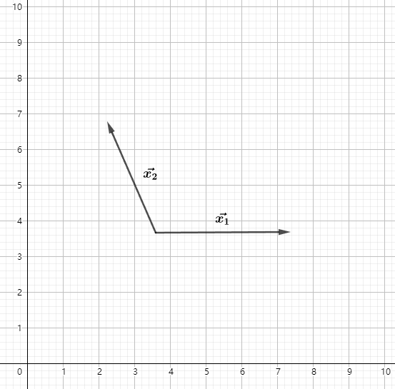

# 图形学的数学基础（六）：施密特正交化(Schmidt orthogonalization)与叉乘正交化

## 标准正交基
在很多情况下，例如在计算相机的lookAt矩阵中，由于传入的$\mathbf{direction}$ $\mathbf{up}$ $\mathbf{right}$三个基矢量不一定是规范化的，需要对三个矢量进行正交化处理，这样才能组成标准正交基。
本文将介绍两种常见的矢量正交化方法。施密特正交化和矢量叉积。

## 施密特正交化

施密特正交化是求欧式空间正交基的一种方法。从欧式空间任意线性无关的向量组$\mathbf{\alpha_1},\mathbf{\alpha_2},...,\mathbf{\alpha_m}$出发，求得正交向量组 $\mathbf{\beta_1},\mathbf{\beta_2},...,\mathbf{\beta_m}$,再将正交向量组中每个向量归一化，得到一个标准正交向量组，这种方法称为施密特正交化。

### 计算方法
如果$\vec{x_1},\vec{x_2},...\vec{x_n}$是某向量空间的基，那么可以通过以下公式找到该向量空间中的n个两两正交的向量$\vec{v_1},\vec{v_2},...\vec{v_n}$

配图来源：《马同学图解数学-如何理解施密特正交化？》

### 推导
施密特正交化主要利用了矢量点积的投影性质，可以将矢量分解为平行和垂直两个矢量。以下我们分别以二维向量空间和三维向量空间为例详细介绍施密特正交化的推导过程。

#### 二维向量空间的推导
1. 假设二维空间的任意向量$\vec{x_1}$ $\vec{x_2}$

2. 任选其一作为$\vec{v_1}$,比如$\vec{x_1}$.利用向量点积，将$\vec{x_2}$在$\vec{v_1}$上投影。得到$\vec{x_⊥}$，根据向量的三角形法则，$\vec{x_∥} = \vec{x_2} - \vec{x_⊥}$即为要求的$\vec{v_2}$

$\vec{v_1} = \vec{x_1}$

$\vec{x_⊥} = \dfrac{\vec{x_2}.\vec{v_1}}{||\vec{v_1}||} \hat{v_1} = \dfrac{\vec{x_2}.\vec{v_1}}{\vec{v_1}.\vec{v_1}} \hat{v_1}||\vec{v_1}|| = \dfrac{\vec{x_2}.\vec{v_1}}{\vec{v_1}.\vec{v_1}}\vec{v_1}$

$\vec{v_2} = \vec{v_∥} = \vec{x_2} - \vec{x_⊥} = \vec{x_2} - \dfrac{\vec{x_2}.\vec{v_1}}{\vec{v_1}.\vec{v_1}}\vec{v_1}$

$\hat{v_1} = \dfrac{\vec{v_1}}{||\vec{v_1}||}$

$\hat{v_2} = \dfrac{\vec{v_2}}{||\vec{v_2}||}$

#### 三维向量空间的推导
三维向量空间的正交化推导与二维空间类似，假设三维空间的任意向量 $\vec{x_1}$ $\vec{x_2}$ $\vec{x_3}$.
先任选两个向量做二维空间的正交化，例如$\vec{x_1}$ $\vec{x_2}$,得到$\hat{v_1}$,$\hat{v_2}$.
将 $\vec{x_3}$在$\hat{v_1}$,$\hat{v_2}$所张成的二维平面上投影，得到$\vec{x_3⊥}$，由于$\vec{x_3⊥}$在$\hat{v_1}$,$\hat{v_2}$的张成平面上，所以$\vec{x_3⊥}$是$\hat{v_1}$,$\hat{v_2}$的线性组合。

$\vec{x_3⊥} = k_1\hat{v_1} + k_2\hat{v_2}$

$\vec{v_3} = \vec{x_3} - \vec{x_3⊥}$

$\vec{v_3} = \vec{x_3} - k_1\hat{v_1} - k_2\hat{v_2}$

由于$\vec{v_3}$垂直于$\hat{v_1}$和${\hat{v_2}}$, $\hat{v_1}$,${\hat{v_2}}$正交，因此：

$ \vec{v_3}.\hat{v_1} = 0$

$\vec{v_3}.\hat{v_2} = 0$

$\hat{v_2}.\hat{v_1} = 0$

由此可以推导出：

$\vec{v_3}.\hat{v_1} = (\vec{x_3} - k_1\hat{v_1} - k_2\hat{v_2}).\hat{v_1} = 0$

$\vec{x_3}.\hat{v_1} - k_1\hat{v_1}.\hat{v_1} - k_2\hat{v_2}.\hat{v_1} = 0 $

$\vec{x_3}.\hat{v_1} - k_1\hat{v_1}.\hat{v_1} = 0 $

$k_1 = \dfrac{\vec{x_3}.\hat{v_1}}{\hat{v_1}.\hat{v_1}}$

同理可得出： $k_2 = \dfrac{\vec{x_3}.\hat{v_2}}{\hat{v_2}.\hat{v_2}}$

$\vec{v_3} = \vec{x_3} - k_1\hat{v_1} - k_2\hat{v_2} = \vec{x_3} - \dfrac{\vec{x_3}.\hat{v_1}}{\hat{v_1}.\hat{v_1}}\hat{v_1} - \dfrac{\vec{x_3}.\hat{v_2}}{\hat{v_2}.\hat{v_2}}\hat{v_2}$

## 向量叉乘
假设三维空间中的三个向量$\vec{x_1}$ $\vec{x_2}$ $\vec{x_3}$.下边我们使用向量叉乘的方法对对其正交化。

- 任选其一作为$\vec{v_1}$,例如$\vec{x_1}$ 

    $\vec{v_1} = \vec{x_1}$
- 任选另外两个向量其一和$\vec{v_1}$叉乘例如$\vec{v_1} \times \vec{x_2}$ 得到$\vec{v_3}$
 
     $\vec{v_3} = \vec{v_1} \times \vec{x_2}$
     
- 用$\vec{v_3}和\vec{v_1}$叉乘得到$\vec{v_2}$

    $\vec{v_2} = \vec{v_3} \times \vec{x_1}$
    
- $\hat{v_1} = \dfrac{\vec{v_1}}{||\vec{v_1}||}$  $\hat{v_2} = \dfrac{\vec{v_2}}{||\vec{v_2}||}$  $\hat{v_3} = \dfrac{\vec{v_3}}{||\vec{v_3}||}$

至此通过以上几个步骤，完成了矢量的正交化。

## 引用
[如何理解施密特正交化](https://zhuanlan.zhihu.com/p/485838766)

