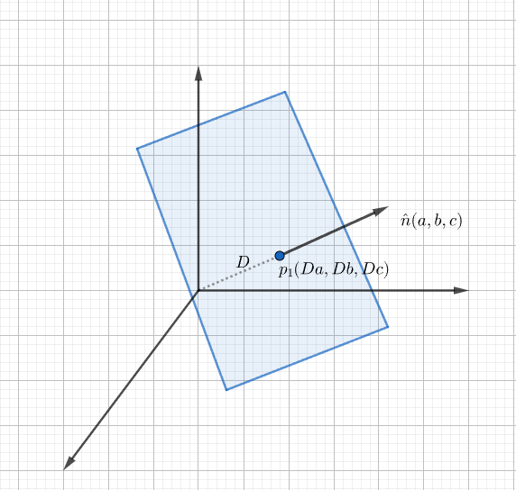

# 图形学的数学基础（十七）：几何图元-平面(下)

    转载请注明出处

上章推导了平面方程的定义。这章介绍几种和平面有关的常见求交和计算点到平面距离的方法。

## 平面距原点的最短（垂直）距离
如果平面的法线是单位矢量,则平面方程的常数项$d$是原点到平面的有符号距离。

假设单位矢量$\hat{n}$ $\begin{bmatrix}a\\ b\\ c\\ \end{bmatrix}$,则平面上的一点$\textbf{P}_1$可以写成$\begin{bmatrix}Da\\ Db\\ Dc\end{bmatrix}$的形式，D是从原点到平面的垂直有符号距离。因此我们可以将平面方程重写如下：

$\begin{bmatrix}a\\ b\\ c\\\end{bmatrix}\cdot\begin{bmatrix}x-Da\\ y-Db\\ z-Dc\\\end{bmatrix} = 0$

$a(x-Da) + b(y-Db) + c(z-Dc) = 0$

$ax + by + cz -D(a^2 + b^2 + c^2) = 0$

$ax + by + cz -D||\vec{n}|| = 0$

因此原点到平面的垂直有符号距离 $D = \dfrac{d}{||\vec{n}||}$,其中$\textbf{d}$为平面方程的常数项。

## 任意点到平面的最短（垂直）距离
很多时候我们可能会有一个平面和一个不在平面内的点$\textbf{q}$，然后想要计算从该平面到$\textbf{q}$的距离。如果该距离为负数，则$\textbf{q}$在平面的背面，反之在正面。为此我们假设平面中的一个点$\textbf{p}$，它是该平面中与$\textbf{q}$最近的点，显然从$\textbf{p}到\textbf{q}$的矢量垂直于平面，因此它是$a\vec{n}$的另外一种形式。

对于平面$ax + by + cz+d = 0$，任意一点$\textbf{q}$到平面的最短距离推导如下：

$\textbf{p} + a\vec{n} = \textbf{q}$

$(\textbf{p} + a\vec{n})\cdot\vec{n} = \textbf{q}\cdot\vec{n}$

$\textbf{p}\cdot\vec{n} + a\vec{n}\cdot\vec{n} = \textbf{q}\cdot\vec{n}$

$d||\vec{n}|| + a||\vec{n}||^2 = \textbf{q}\cdot\vec{n}$

$d||\vec{n}|| + a||\vec{n}||^2 = \textbf{q}\cdot\hat{n}||\vec{n}||$

$d + a||\vec{n}|| = \textbf{q}\cdot\hat{n}$

$a = \dfrac{\textbf{q}\cdot\hat{n} - d}{||\vec{n}||}$

对于单位矢量则有：

$a = \textbf{q}\cdot\hat{n} - d$

## 求解三平面的交点
求解三平面相交交点，我们只需要解三个平面方程组成的线性方程组即可：

$\begin{cases}
    a_1x+b_1y+c_1z + d_1 = 0\\ 
    a_2x+b_2y+c_2z + d_2 = 0\\ 
    a_3x+b_3y+c_3z + d_3 = 0\\ 
\end{cases}$
可以写成矩阵的形式：

$\begin{bmatrix}
    a_1&b_1&c_1\\ 
    a_2&b_2&c_2\\ 
    a_3&b_3&c_3\\ 
\end{bmatrix}\begin{bmatrix}
    x\\ y\\ z\\ 
\end{bmatrix} = \begin{bmatrix}
    -d_1\\ 
    -d_2\\ 
    -d_3\\ 
\end{bmatrix}$

$\begin{bmatrix}
    x\\ y\\ z\\ 
\end{bmatrix} = \begin{bmatrix}
    
\end{bmatrix}$

## 求两平面相交的直线方程

## 平面直线相交
空间中的平面和直线可能会相较于某一点，交点可以通过平面和直线的线性方程组求解：

$\begin{cases}
    \textbf{Plane}, & ax+by+cz+d = 0\\ 
    \textbf{Line}, & \textbf{p}_1 + t\vec{v} = (x_1+tv_x,y_1+tv_y,z_1+tv_z) 
\end{cases}$

$t = \dfrac{-(ax_1+by_1+cz_1+d)}{av_x+bv_y+cv_z}=\dfrac{-(\vec{n}\cdot\textbf{p}_1+d)}{\vec{n}\cdot\vec{v}}$
