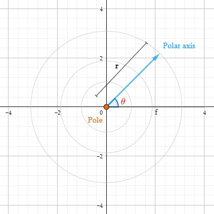
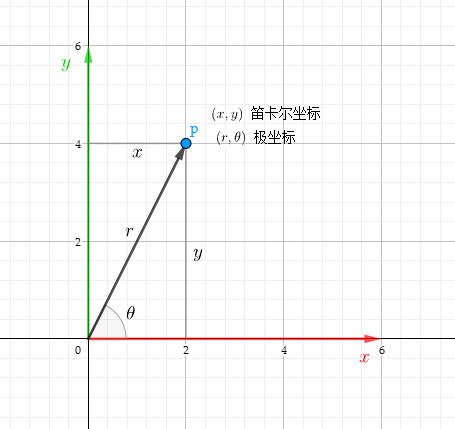
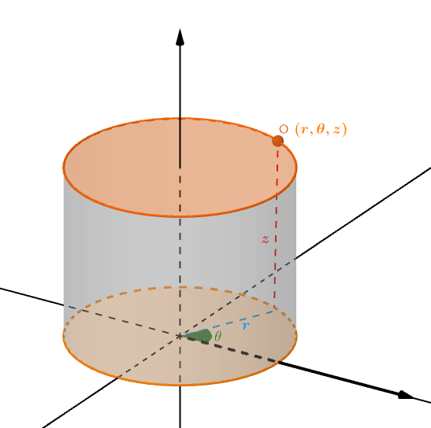
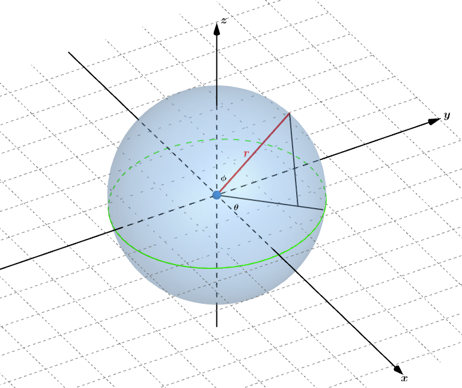

# 图形学的数学基础（十二）：极坐标系

笛卡尔坐标系不是精确绘制空间和定义位置的唯一系统。笛卡尔系统的替代方案是极坐标系($Polar\;Coordinate\;System$)

## 二维极坐标系

二维笛卡尔坐标系有一个原点和两个穿过原点的轴（x，y）。二维极坐标空间也有一个原点，称为极点（$Pole$）-定义了坐标空间的中心,不同的是,极坐标系只有一个轴,称为极轴（$Polar\; Axis$）,

### 定义

在极坐标系中,我们通常用$(r,\theta)$定义一个点,r为极轴的长度,$\theta$为极轴旋转角度(逆时针方向).

### 别名
极坐标系中有一个不同于笛卡尔坐标系的显著特征.笛卡尔坐标系中空间中一个点对应唯一的坐标(x,y)，而在极坐标中，空间中的一个点可能对应多个坐标.原因就在于极坐标系的定义($r, \theta$)。$\theta与\theta + 360^°$指定的是同一个方向。也可以将$\theta + 180^°$同时r取反来实现。

因此：$(r,\theta) = (r, \theta + 360^°) = ((-1)^kr, \theta + k180^° )$。
尽管存在别名，但是我们尽可能需要采用最优的描述点的方式。描述任何给定点的“首选”方式称为该点的规范（$Canonical$）坐标,规范化坐标需要满足以下三个条件：
- $r>=0$
- $-180^° < \theta <= 180^°$
- $如果 r = 0，则 \theta = 0$

### 笛卡尔坐标系和极坐标转换(二维)

假设二维空间中的一点$P$，笛卡尔坐标为$(x, y)$，极坐标表述为$(r, \theta)$,则它们之间的转换关系如下：

**笛卡尔坐标系和极坐标转换主要用到了三角函数**.

#### 二维极坐标系转换为笛卡尔坐标系

$x = r\cos\theta$

$y = r\sin\theta$

#### 笛卡尔坐标系转换极坐标系

$r = \sqrt{x^2 + y^2}$

$\theta = \arctan2(y,x)$

## 三维极坐标系
极坐标系同样可应用于三维，三维极坐标系有三个值，是从二维极坐标系拓展而来的，第三个坐标值可以是角度也可以是另外个长度。这样就衍生出了两种极坐标系。

### 圆柱坐标（$Cylindrical\;Coordinate$）
如果第三个极坐标值添加的是线性距离（$z$），那么得到的就是一个圆柱坐标。

#### 球面坐标和三维笛卡尔坐标转换

由上图可知，球面坐标和三维笛卡尔坐标的z值是相同的，因此只需要按照二维极坐标的转换逻辑转换xy值即可

圆柱坐标转换为三维坐标：

$x = r\cos\theta$

$y = r\sin\theta$

$z = z$

三维坐标转换为圆柱坐标：

$r = \sqrt{x^2+y^2}$

$\theta = \arctan2(y, x)$

$z = z$

### 球面坐标（$Spherical\;Coordinate\;System$）
更常见的三维坐标系是球面坐标系，球面坐标具有两个角度和一个距离$(r, \theta, \phi)$。三维球形空间中有两个极轴：  第一个水平轴，对应二维极坐标中的极轴，另一个垂直轴 对应三维笛卡尔坐标的$+y$。

#### 三维极坐标定位方式

- 站在原点，面向水平极轴方向（$x$），垂直轴的指向从脚指向头部。右臂向上。指向垂直极轴。
- 逆时针旋转$\theta$
- 将手臂向下旋转角度$\phi$，右臂现在指向极角$\theta和\phi$的方向。
- 沿着该方向从原点移动距离r，这时你就叨叨了球面坐标$(r,\theta,\phi)$描述的点。

水平角$\theta$称为方位角（$Azimuth$）,$\phi$称为天顶($Zenith$)。我们日常使用的经纬度其实也是一种球面坐标系。经度($Longitude$)与$\theta$相同，维度($Latitude$)是$90^° - \phi$。由于我们通常只描述行星表面的点，所以r是个常数。

#### 球面坐标规范化条件

- $r >= 0$
- $180^° < \theta <= 180^°$
- $-90^° < \phi <= 90^°$
- $如果r = 0，则\theta = 0^° \phi = 0^°$
- $如果|\phi| = 90^°，则\theta = 0^°$

#### 球面坐标和三维笛卡尔坐标的转换（右手系）

由上图可知：
**球面坐标->三维笛卡尔坐标：**

$d = r\sin\phi$

$x = d\cos\theta = r\sin\phi\cos\theta$

$y = d\sin\theta = r\sin\phi\sin\theta$

$z = r\cos\phi$

**三维笛卡尔坐标->球面坐标：**

$r=\sqrt{x^2+y^2+z^2}$

$\theta = \arctan2(y,x)$

$\phi = \arctan2(r, z)$

## 参考
[《3D数学基础》图形和游戏开发(第二版)](https://item.jd.com/12659881.html)