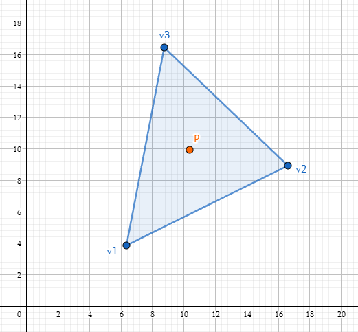
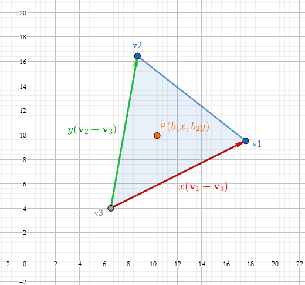

# 图形学的数学基础（十九）：几何图元-重心坐标

## 定义重心坐标($Barycentric\;Coordinates$)
对于空间内的三角形$\triangle{v_1v_2v_3}$和任意一点$\textbf{p}$，必定唯一存在三个数$b_1,b_2,b_3$,满足：

$b_1+b_2+b_3 = 1$

$\textbf{p} = b_1\textbf{v}_1 + b_2\textbf{v}_2+ b_3\textbf{v}_3$

则$b_1,b_2,b_3$就称为$\textbf{p}$点在此三角形$\triangle{v_1v_2v_3}$上的重心坐标.

重心坐标表示了三角形每个顶点对该点的权重（贡献），重心坐标可以用来三角形光栅化顶点的属性插值，比如说uv 颜色 法线的线性插值。

重心坐标也是一种坐标系统，类似于普通笛卡尔坐标系，但有一个区别就是，重心坐标的三个分量之和为1：

$b_1 + b_2 + b_3 = 1$

**这种归一化的约束消除了一个自由度，因此即使有三个坐标，它仍然是一个二维空间。**

重心坐标不仅适用于三角形内的点，对于边上的点甚至三角形外的点都是适用的，三角形内的重心坐标都是被限制到[0,1]范围内，三角形外的任何点都至少有一个负坐标。

还有一种解释重心坐标的角度，丢弃$b_3$,将$(b_1,b_2)$解释为常规的二维坐标，原点位于$\textbf{v}_3$,x轴是$\textbf{v}_1-\textbf{v}_3$,y轴是$\textbf{v}_2-\textbf{v}_3$

$(b_1,b_2,b_3)\\=> b_1\textbf{v}_1 + b_2\textbf{v}_2 + b_3\textbf{v}_3\\
=> b_1\textbf{v}_1 + b_2\textbf{v}_2 + (1-b_1-b_2)\textbf{v}_3\\
=> b_1\textbf{v}_1 + b_2\textbf{v}_2 + \textbf{v}_3 - b_1\textbf{v}_3-b_2\textbf{v}_3\\
=> \textbf{v}_3 + b_1(\textbf{v}_1 -\textbf{v}_3) + b_2(\textbf{v}_2 - \textbf{v}_3)
$

## 计算重心坐标

