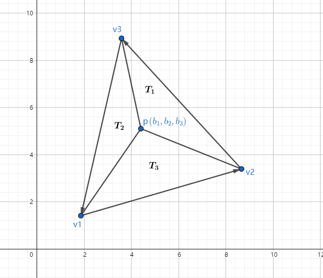
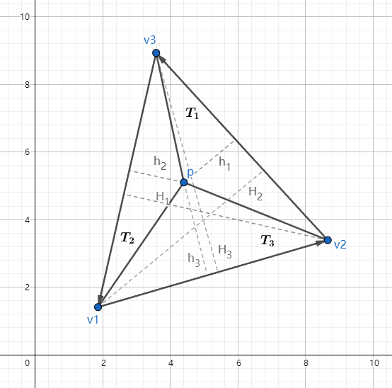
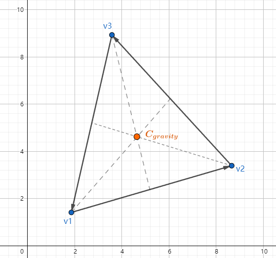
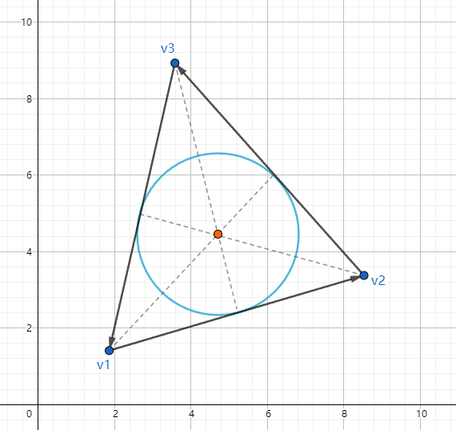
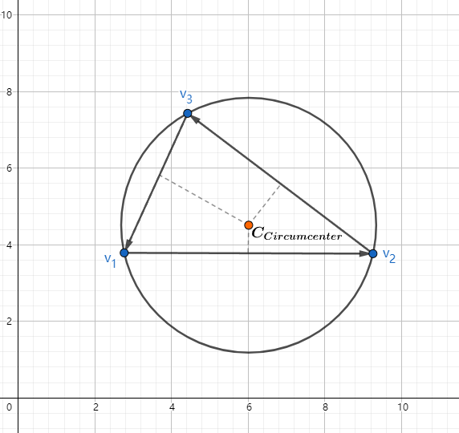

# 图形学的数学基础（十九）：几何图元-重心坐标

## 定义重心坐标($Barycentric\;Coordinates$)
对于空间内的三角形$\triangle{v_1v_2v_3}$和任意一点$\textbf{p}$，必定唯一存在三个数$b_1,b_2,b_3$,满足：

$b_1+b_2+b_3 = 1$

$\textbf{p} = b_1\textbf{v}_1 + b_2\textbf{v}_2+ b_3\textbf{v}_3$

则$b_1,b_2,b_3$就称为$\textbf{p}$点在此三角形$\triangle{v_1v_2v_3}$上的重心坐标.

重心坐标表示了三角形每个顶点对该点的权重（贡献），重心坐标可以用来三角形光栅化顶点的属性插值，比如说uv 颜色 法线的线性插值。

重心坐标也是一种坐标系统，类似于普通笛卡尔坐标系，但有一个区别就是，重心坐标的三个分量之和为1：

$b_1 + b_2 + b_3 = 1$

**这种归一化的约束消除了一个自由度，因此即使有三个坐标，它仍然是一个二维空间。**

重心坐标不仅适用于三角形内的点，对于边上的点甚至三角形外的点都是适用的，三角形内的重心坐标都是被限制到[0,1]范围内，三角形外的任何点都至少有一个负坐标。

还有一种解释重心坐标的角度，丢弃$b_3$,将$(b_1,b_2)$解释为常规的二维坐标，原点位于$\textbf{v}_3$,x轴是$\textbf{v}_1-\textbf{v}_3$,y轴是$\textbf{v}_2-\textbf{v}_3$

$(b_1,b_2,b_3)\\=> b_1\textbf{v}_1 + b_2\textbf{v}_2 + b_3\textbf{v}_3\\
=> b_1\textbf{v}_1 + b_2\textbf{v}_2 + (1-b_1-b_2)\textbf{v}_3\\
=> b_1\textbf{v}_1 + b_2\textbf{v}_2 + \textbf{v}_3 - b_1\textbf{v}_3-b_2\textbf{v}_3\\
=> \textbf{v}_3 + b_1(\textbf{v}_1 -\textbf{v}_3) + b_2(\textbf{v}_2 - \textbf{v}_3)
$

## 计算重心坐标

已知p的坐标和$v_1,v_2,v_3$的顶点坐标，求p的重心坐标$(b_1,b_2,b_3)$,只需要求解线性方程组即可：

$\begin{cases}
    b_1x_1 +b_2x_2 + b_3x_3 = p_x\\
    b_1y_1 +b_2y_2 + b_3y_3 = p_x\\
    b_1+b_2+b_3 = 1
\end{cases}$

求解该方程组得到：

$b_1 = \dfrac{(p_y-y_3)(x_2-x_3)+(y_2-y_3)(x_3-p_x)}{(y_1-y_3)(x_2-x_3)+(y_2-y_3)(x_3-x_1)}$

$b_1 = \dfrac{(p_y-y_1)(x_3-x_1)+(y_3-y_1)(x_1-p_x)}{(y_1-y_3)(x_2-x_3)+(y_2-y_3)(x_3-x_1)}$

$b_1 = \dfrac{(p_y-y_2)(x_1-x_2)+(y_1-y_2)(x_2-p_x)}{(y_1-y_3)(x_2-x_3)+(y_2-y_3)(x_3-x_1)}$

可以看到每个表达式中的分母是相同的，根据三角形的面积公式可得：$A = \dfrac{(y_1-y_3)(x_2-x_3)+(y_2-y_3)(x_3-x_1)}{2}$，它等于三角形面积的两倍，而且对于每个重心坐标$b_i$来说，其分子等于“子三角形”$T_i$的面积的两倍：

$b_1 = \dfrac{A(T_1)}{A(T)}, b_2 = \dfrac{A(T_2)}{A(T)}, b_3 = \dfrac{A(T_3)}{A(T)}$

因此得出结论：**重心坐标等于对面子三角形与大三角形的比例。**

所以计算重心坐标可先叉乘计算面积，再求面积比。另外因为公底边三角形面积比等于高(有向高)的比，因此：

$\begin{cases}
    b_1 = \dfrac{h_1}{H_1}\\
    b_2 = \dfrac{h_2}{H_2}\\
    b_3 = \dfrac{h_3}{H_3}\\
\end{cases}$

## 重心 内心 外心

### 重心（$Center of Gravity$）

重心，也称为质心($Centroid$)，是三角形完美平衡的点。它是中线的交点（中线是从一个顶点到对边中点的直线）。如下图：

重心是三个顶点的几何平均值：

$C_{gravity} = \dfrac{\textbf{v}_1 + \textbf{v}_2 + \textbf{v}_3}{3}$

重心的重心坐标为：$(\dfrac{1}{3},\dfrac{1}{3},\dfrac{1}{3})$

### 内心（$Incenter$） 
内心是三角形三条角平分线的交点。它也是三角形内切圆的圆心。由此可知，内心与三角形各条边的距离是相等的：

假设$P = l_1 + l_2 + l_3$为三角形的周长,$l_1,l_2,l_3为每条边长$，则内心的重心坐标可是表示为边长与周长比：

$(\dfrac{l_1}{p},\dfrac{l_2}{p},\dfrac{l_3}{p})$

内心的坐标：

$C_{Incenter} = \dfrac{l_1\textbf{v}_1 + l_2\textbf{v}_2+ l_3\textbf{v}_3}{p}$

内切圆半径为三角形面积除以三角形周长：

$r_{Incenter} = \dfrac{A}{p}$

### 外心（$Circumcenter$）

外心是三角形中与顶点等距的点。它是围绕三角形的外接圆的圆心。外心构造为各条边的垂直平分线的交点。

#### 外心的计算

$d_1 = -\vec{e_2}\cdot\vec{e_3}$

$d_2 = -\vec{e_3}\cdot\vec{e_1}$

$d_3 = -\vec{e_1}\cdot\vec{e_2}$

$c_1 = d_2d_3$

$c_2 = d_3d_1$

$c_3 = d_1d_2$

$c = c_1 + c_2 + c_3$

外心重心坐标：$(\dfrac{c_2+c_3}{2c},\dfrac{c_3+c_1}{2c},\dfrac{c_1+c_2}{2c})$

外心坐标：$C_Circumcenter = \dfrac{(c_2+c_3)\textbf{v}_1+(c_3+c_1)\textbf{v}_2+(c_1+c_2)\textbf{v}_3}{2c}$

外接圆半径：$r_Circumcenter = \dfrac{\sqrt{(d_1+d_2)(d_2+d_3)(d_3+d_1)}}{2}$

## 参考

[《3D数学基础》图形和游戏开发(第二版)](https://item.jd.com/12659881.html)