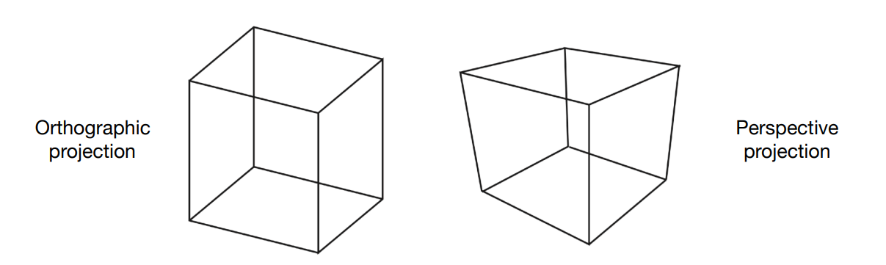

# 图形学的数学基础（十二）：mvp变换（下）

本章我们将实现mvp变换中的投影变换（$projection Transform$），将视图从相机空间映射到$[-１,１]^３$的标准立方体中，投影变换有两种方式，分别为正交投影（$Orthographic projection$）和透视投影（$perspective projection$）.如下图所示：

## 正交投影（$Orthographic projection$）

正交投影会保持几何图元相对位置关系不变，平行的线永远平行。不满足透视关系。

## 透视投影（$perspective projection$）

透视投影满足透视关系，即近大远小的效果。平行的线可能在远处相较于某一点。

