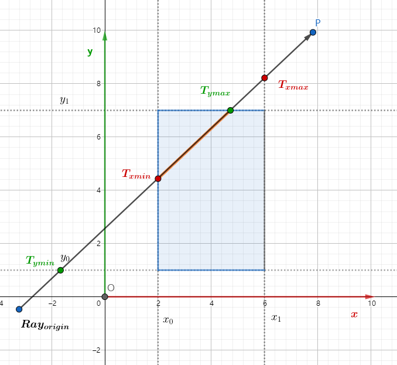

# 图形学的数学基础（十二）：几何图元-包围盒($Bounding Box$)
包围盒是一种求解离散点集最优包围空间的算法,基本思想是用体积稍大且特性简单的几何形状来近似代替复杂的几何对象。包围盒常用于几何物体的碰撞检测，ray-tracing中光线求交等。常用的包围盒有两种，$AABB与OBB$，AABB包围盒是轴对齐的，而$OBB$是有向的。

## $AABB$
$AABB$是$Axially\;Aligned\;Bounding\;Box$的缩写，三维$AABB$是一个简单的6面盒子，每一面都与一个基向量形成的面平行，这个盒子不一定是立方体，盒子的长度宽度高度可以各自不同。

### 重要属性

几何体$AABB$包围盒内的点满足以下不等式：

$x_{min} <= x <= x_{max}$

$y_{min} <= y <= y_{max}$

$z_{min} <= z <= z_{max}$

两个具有特殊意义的点：

- 最小值：$\textbf{P}_{min} = [x_{min}, y_{min}, z_{min}]$

- 最大值：$\textbf{P}_{max} = [x_{max}, y_{max}, z_{max}]$

中心点可以通过最小值和最大值的中点计算得出：

$\textbf{c} = \dfrac{(\textbf{P}_{min} + \textbf{P}_{max})}{2}$

大小向量($Size\;Vector$)$s$是从$\textbf{P}_{min}$到$\textbf{P}_{max}$的向量，该向量的三个分量分别代表了包围盒的长宽高信息。

### 表示法
一般情况下会使用$\textbf{P}_{min}$和$\textbf{P}_{max}$表示包围盒。

### 计算$AABB$
针对一组点计算$AABB$是一个很简单的过程，首先初始化min和max两个值，初始值分别设置为最大值和最小值，遍历点位集合，分别比较判断$min,max$的三个分量，将当前最小值赋给$min$最大值赋给$max$。

### 变换$AABB$
有时候我们需要将$AABB$从一个坐标空间转换为另一个坐标空间。假如已知对象空间的$AABB$,现在期望获取世界空间的$AABB$,其中一种做法就是，可以基于变换后的几何体顶点，重新计算包围盒，但是针对复杂的几何体，顶点数量特别多，这种计算开销太大，因此在世界空间中获得$AABB$，就需要考虑变换对象空间的$AABB$。
要为变换后的对象计算$AABB$，仅变换$\textbf{P}_{min}和\textbf{P}_{max}$是不够的，这可能导致假的包围盒，
在经过变换后，通常导致包围盒大于原始包围盒。而通过变换后的对象重新计算$AABB$将与原始的$AABB$大致相同。

#### 矩阵变换$AABB$
当我们对空间中一个点做变换时，可以采用矩阵形式：

$\begin{bmatrix}
x^丶\\ y^丶\\ z^丶\\ 
\end{bmatrix} = \begin{bmatrix}
m_{11}&m_{12}&m_{13}\\ 
m_{21}&m_{22}&m_{23}\\ 
m_{31}&m_{32}&m_{33}\\ 
\end{bmatrix}\begin{bmatrix}
x\\ y\\ z\\ 
\end{bmatrix}$

$x^丶 = m_{11}x + m{12}y+m_{13}z$

$y^丶 = m_{21}x + m{22}y+m_{23}z$

$z^丶 = m_{31}x + m{32}y+m_{33}z$

假设$x,y,z$是原始八个顶点中的任何一个，我们的工作是找出变换后哪些顶点具有最小的$x$值。最小化整个总和的技巧是单独最小化3个乘积的每一个。我们来看第一个乘积$m_{11}x$，我们必须决定用$x_{min}或x_{max}$中的哪一个来代替$x$以便最小化乘积。显然如果$m_{11} > 0$,则二者中较小的$x_{min}$将导致较小的乘积。

### 光线与$AABB$求交
包围盒常用来做物体的碰撞监测，光线的相交测试等。尤其在光线追踪中，包围盒常用来做光线与物体相交测试。基本思想是这样的，我们将包围盒的长方体看做是三对互相平行的平面相交所形成的区域。尤其对于$AABB$，每一对平行面都是与一个轴对齐的。根据这个特性，先以二维空间举例：

$AABB$由两对平面构成，分别是平行于$x轴和y轴$。根据光线公式可知：

$Ray = \textbf{o} + \textbf{d}t$

其中$o$为光线起点，$d$为光线方向，Ray是光线经过t时间到达的位置。 

如何判定光线是否与包围盒相交呢？我们可以通过分解，将问题简化，将光线分别穿过每对无限延申的平面，分别求出其$T_{min}和T_{max}$：

与$x$轴垂直的一对平面的交点：

$T_{xmin}d_x + o_x = x_0$

=>

$T_{xmin} = \dfrac{x_0 - o_x}{d_x}$

$T_{xmax}d_x + o_x = x_1$

=> 

$t_{xmax} = \dfrac{x_1 - o_x}{d_x}$

与$y$轴垂直的一对平面的交点：

$T_{ymin}d_y + o_y = y_0$

=>

$T_{ymin} = \dfrac{y_0 - o_y}{d_y}$

$T_{ymax}d_y + o_y = y_1$

=> 

$t_{ymax} = \dfrac{y_1 - o_y}{d_y}$

现在我们想象空间中的一条光线，只有当光线进入了所有的“平面对”，才算进入了盒子，光线只要离开了任何“平面对”，就算离开了盒子，因此光线进入盒子的时间实际上是进入所有“平面对”的最大值，即**最小时间的最大值**，而离开盒子的时间是光线离开“平面对”的最小值，即**最大时间的最小值**。（求交）

考虑三维情况下光线与$AABB$求交。关键点：

- 当且仅当光线进入了所有“平面对”，光线进入盒子。
- 只要光线离开了一组“平面对”，光线就离开了盒子。

对于三维空间，我们有三组“平面对”，分别计算$t_{min}和t_{max}$，因此有：

$t_{enter} = max(t_{minx}, t_{miny}, t_{minz})$

$t_{exit} = min(t_{maxx}, t_{maxy}, t_{maxz})$

当且仅当$t_{enter} < t_{exit}$时，我们认为“光线在盒子里停留了一段时间”，即光线与盒子相交。

但是以上推断没有考虑t为负值的情况，当$t_{exit} < 0$时，盒子在光线背面，必然不会出现交点（光线是单向的），当 $t_{exit} >= 0 并且t_{enter} < 0时$，光线起点在盒子里边，那么光线必然与盒子相交。因此得出结论：

光线$Ray$与$AABB$相交，当且仅当：

$t_{enter} < t_{exit}$  
$t_{exit} \;\;>= 0$

## 参考

[《3D数学基础》图形和游戏开发(第二版)](https://item.jd.com/12659881.html)

[GAMES101 -现代计算机图形学入门-闫令琪](https://www.bilibili.com/video/BV1X7411F744?p=5&spm_id_from=pageDriver&vd_source=b3b87210888ec87be647603921054a36)

