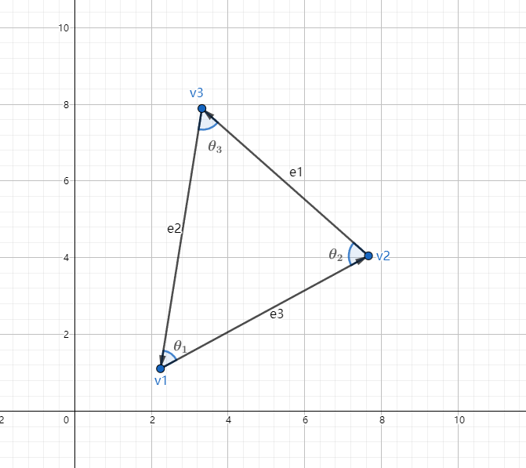
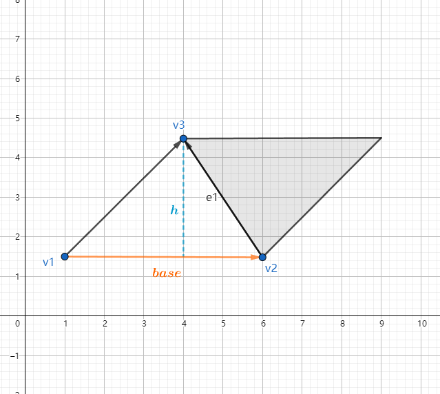

# 图形学的数学基础（十八）：几何图元-三角形

三角形在图形学中具有重要性的意义。复杂三维对象的表面与许多三角形近似。这样一组链接的三角形可形成一个三角形网格（$Triangle\;Mesh$），本章将介绍三角形基本属性，重点是重心坐标。

## 定义

定义一个三角形，只需要三个顶点即可，这些点的顺序至关重要，因为它们的顺序决定了三角面的正反，在右手系中，当从三角形正面看时，通常按逆时针方向枚举点（右手螺旋定则）。

边矢量，边长 顶点定义如下：

$\vec{e_1} = \textbf{v}_3 - \textbf{v}_2$

$\vec{e_2} = \textbf{v}_1 - \textbf{v}_3$

$\vec{e_3} = \textbf{v}_2 - \textbf{v}_1$

$l_1 = ||\vec{e_1}||$

$l_2 = ||\vec{e_2}||$

$l_3 = ||\vec{e_3}||$

## 三角形常用公式

- 正弦定理：$\dfrac{\sin\theta_1}{l_1} = \dfrac{\sin\theta_2}{l_2} = \dfrac{\sin\theta_3}{l_3}$
  

- 余弦定理：$\begin{cases}
    {l_1}^2 = {l_2}^2 + {l_3}^2-2l_2l_3\cos\theta_1\\ 
    {l_2}^2 = {l_1}^2 + {l_3}^2-2l_1l_3\cos\theta_2\\ 
    {l_3}^2 = {l_1}^2 + {l_2}^2-2l_1l_2\cos\theta_3\\ 
\end{cases}$

- 三角形周长：$p = l_1+l_2+l_3$

## 三角形面积

由上图可知，平行四边形的面积等于底乘高，而三角形占据了平行四边形面积的一半，因此三角形面积为：

$\textbf{A} = \dfrac{base.h}{2}$

### 海伦公式

求解三角形面积的第二种方式是海伦公式。

$s = \dfrac{l_1+l_2+l_3}{2} = \dfrac{p}{2}$

$\textbf{A} = \sqrt{s(s-l_1)(s-l_2)(s-l_3)}$