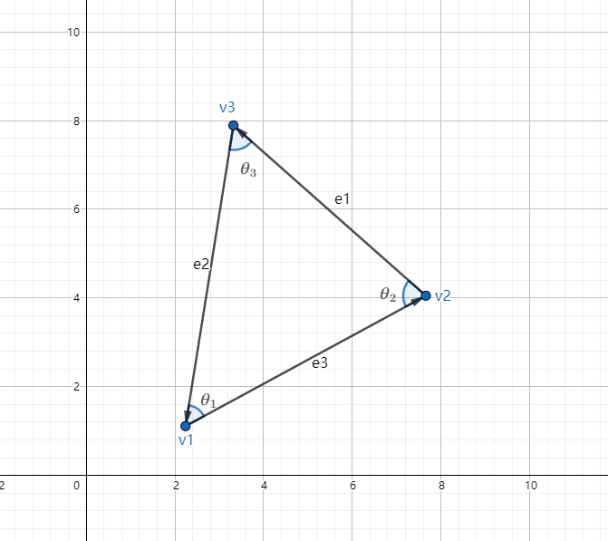
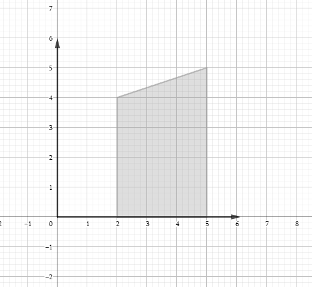

# 图形学的数学基础（十）：几何图元-三角形
三角形在图形学中具有重要意义。复杂三维对象的表面都是由庞大三角形网格组成（$Triangle\;Mesh$），本章将介绍三角形基本属性，重点是重心坐标。

## 定义
定义一个三角形，只需要三个顶点即可，这些点的顺序至关重要，因为它们的顺序决定了三角面的正反，在右手系中，当从三角形正面看时，通常按逆时针方向枚举点（右手螺旋定则）。

边向量，边长 顶点定义如下：

$\vec{e_1} = \textbf{v}_3 - \textbf{v}_2$

$\vec{e_2} = \textbf{v}_1 - \textbf{v}_3$

$\vec{e_3} = \textbf{v}_2 - \textbf{v}_1$

$l_1 = ||\vec{e_1}||$

$l_2 = ||\vec{e_2}||$

$l_3 = ||\vec{e_3}||$

## 三角形常用公式
- 正弦定理：$\dfrac{\sin\theta_1}{l_1} = \dfrac{\sin\theta_2}{l_2} = \dfrac{\sin\theta_3}{l_3}$
  
- 余弦定理：$\begin{cases}
    {l_1}^2 = {l_2}^2 + {l_3}^2-2l_2l_3\cos\theta_1\\ 
    {l_2}^2 = {l_1}^2 + {l_3}^2-2l_1l_3\cos\theta_2\\ 
    {l_3}^2 = {l_1}^2 + {l_2}^2-2l_1l_2\cos\theta_3\\ 
\end{cases}$

- 三角形周长：$p = l_1+l_2+l_3$

## 三角形面积

### 平行四边形

由上图可知，平行四边形的面积等于底乘高，而三角形占据了平行四边形面积的一半，因此三角形面积为：

$\textbf{A} = \dfrac{base.h}{2}$

### 海伦公式
求解三角形面积的第二种方式是海伦公式。

$s = \dfrac{l_1+l_2+l_3}{2} = \dfrac{p}{2}$

$\textbf{A} = \sqrt{s(s-l_1)(s-l_2)(s-l_3)}$

### 顶点坐标
一般来说,边的高度或长度不太好计算,因为所有的已知条件都是顶点的笛卡尔坐标(当然我们总是可以通过坐标计算边长,但在有些情况下我们尽量避免这种相对昂贵的计算).接下来将介绍通过顶点坐标计算三角形面积的方法。

基本思想就是为三角形的每条边计算梯形的有符号面积，该面积由边和下方的x轴所界定。

根据梯形面积公式：

$\textbf{A} = \dfrac{(上底 + 下底).高}{2}$

则三角形三条边的面积公式分别为：

$\textbf{A}(e_1) = \dfrac{(y_2+y_3)(x_2-x_3)}{2}$

$\textbf{A}(e_2) = \dfrac{(y_3+y_1)(x_3-x_1)}{2}$

$\textbf{A}(e_3) = \dfrac{(y_2+y_1)(x_2-x_1)}{2}$

**可以通过对三个梯形的有符号面积求和，获得三角形本身的面积。实际上可以用这个思路求解任意多边形面积。**

$\textbf{A} = \textbf{A}(e_1) + \textbf{A}(e_2) + \textbf{A}(e_3)\\
    =\dfrac{(y_2+y_3)(x_2-x_3) + (y_3+y_1)(x_3-x_1) + (y_2+y_1)(x_2-x_1)}{2}\\
    =\dfrac{y_1(x_3-x_2) + y_2(x_1-x_3) + y_3(x_1-x_2)}{2}
$

平移三角形不会改变三角形面积，因此我们可以将每个$y$坐标减去$y_3$,进一步做简化：

$\textbf{A} = \dfrac{(y_1-y_3)(x_3-x_2) + (y_2-y_3)(x_1-x_3) + (y_3-y_3)(x_1-x_2)}{2}\\ 
        \ \ \ \ =\dfrac{(y_1-y_3)(x_3-x_2) + (y_2-y_3)(x_1-x_3)}{2}\\
$

### 叉积

三维中可以使用叉积计算三角形的面积，根据叉积的定义，两个向量的叉积的大小等于通过向量两条边形成的平行四边形的面积。由于三角形的面积是平行四边形面积的一半，因此：

$\textbf{A} = \dfrac{||\vec{e_1}\times\vec{e_2}||}{2}$

## 参考
[《3D数学基础》图形和游戏开发(第二版)](https://item.jd.com/12659881.html)

