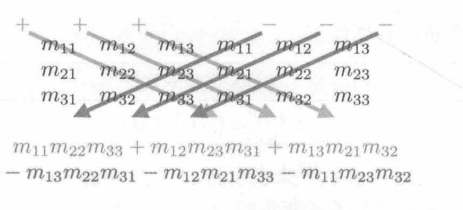

# 图形学的数学基础（十）：矩阵进阶（上）

## 行列式

对于方形矩阵，有一个特殊的标量称为矩阵的行列式（$Determinant$。方形矩阵$\textbf{M}$的行列式表示为$|\textbf{M}|$,也表示为“det M”。非方形矩阵的行列式是未定义的。

### $2\times 2$和$3\times 3$矩阵的行列式

$2\times 2$矩阵行列式：

$\begin{vmatrix}M\end{vmatrix} = \begin{vmatrix}m_{11}&m_{12}\\ m_{21}&m_{22}\end{vmatrix} = m_{11}m_{22} - m_{12}m_{21}$

$3\times 3$矩阵行列式：

$\begin{vmatrix}M\end{vmatrix} = \begin{vmatrix}m_{11}&m_{12}&m_{13}\\ m_{21}&m_{22}&m_{23}\\ m_{31}&m_{32}&m_{33}\end{vmatrix} = m_{11}m_{22} - m_{12}m_{21} = m_{11}m_{22}m_{33} + m_{12}m_{23}m_{31} + m_{13}m_{21}m_{32} - m_{13}m_{22}m_{31} - m_{12}m_{21}m_{33} - m_{11}m_{23}m_{32} = m_{11}(m_{22}m_{33} - m_{23}m_{32}) + m_{12}(m_{23}m_{31} - m_{21}m_{33}) + m_{13}(m_{21}m_{32} - m_{22}m_{31})$

如果将$X\times 3$矩阵的行解释为3个矢量，那么该矩阵的行列式等价于3个矢量的三重积。

$\begin{vmatrix}
    a_x&a_y&a_z\\ b_x&b_y&b_z\\ c_x&c_y&c_z
\end{vmatrix}$ = $(a_yb_z -a_zb_y)c_x + (a_zb_x - a_xb_z)c_y + (a_xb_y - a_yb_x)c_z = (\mathbf{a}\times \mathbf{b})\cdot \mathbf{c}$

### 子矩阵行列式($Minor$)和余子式($Cofactor$)

### 子矩阵行列式
假设$\textbf{M}$具有r行和c列的矩阵，考虑通过$\textbf{M}$中删除行i和列j而获得的矩阵。该矩阵具有r-1行和c-1列。这个矩阵的行列式表示为$\textbf{M}^{ij}$,被称为$\textbf{M}$的子矩阵行列式。

#### 余子式
给定行和列的方形矩阵$\textbf{M}$的余子式与相应的子矩阵行列式相同，但余子式会交替变负，正负取决于因子$(-1)^{i + j}$.矩阵的余子式用来计算$n\times n$任意维度矩阵的行列式。

$C^{ij} = (-1)^{i+j}M^{ij}$

我们使用$C^{ij}$表示行i列j中的$\textbf{M}$的余子式。
+&-&+&-&...\\ 
$\begin{bmatrix}
    +&-&+&-&...\\ -&+&-&+&...\\ +&-&+&-&...\\  -&+&-&+&...\\ ...&...&...&...&...
\end{bmatrix}$

### 行列式的数学定义
对于任意维度$n\times n$矩阵的行列式，可以通过它的余子式计算。这个定义是递归的，因为**余子式本质上是有符号的行列式**。首先从矩阵中任意选择一行或一列。对于行或列中的每个元素，将此元素诚意相应的余子式，对这些乘积求和可得出颠的行列式：

$\begin{vmatrix}
    \textbf{M}
\end{vmatrix} = \sum\limits_{j=1}^n{m_{ij}C^{ij}} = \sum\limits_{j=1}^n{m_{ij}(-1)^{i + j}M^{ij}}$

### 性质

．任何维度单位矩阵的行列式等于1：$\begin{vmatrix}I\end{vmatrix} = 1$

．矩阵乘积的行列式等于行列式的乘积：　$\begin{vmatrix}AB\end{vmatrix} = \begin{vmatrix}A\end{vmatrix}\begin{vmatrix}B\end{vmatrix}$

. 矩阵转置的行列式等于原始行列式：$\begin{vmatrix}M^T\end{vmatrix} = \begin{vmatrix}M\end{vmatrix}$
. 如果矩阵中的任何行或者列包含全0元素，则该矩阵的行列式为0
. 交换任意行对都会让行列式变负

### 几何解释
**在几何上行列式表示了当前变换矩阵对空间的压缩或者拉伸程度。**。即经过一次变换后，空间被压缩或者拉伸了多少。二维中，行列式等于具有基矢量作为两条边的平行四边形的有符号面积。三维中，行列式是平行六面体的体积。

## 逆矩阵（Inverse）

对于方形矩阵来说，另一个重要运算是矩阵的逆矩阵。方形矩阵$\textbf{M}$的逆矩阵表示为$\textbf{M}^-1$.

并非所有矩阵都有逆矩阵。如果某个矩阵具有逆矩阵，则称其为可逆或者非奇异（$Nonsingular$）矩阵。不具有逆的矩阵被认为是不可逆或奇异矩阵。**可逆矩阵的列是先行独立的，列也如此。奇异矩阵的行和列是线性相关的。**

奇异矩阵的行列式为零。非奇异矩阵的行列式为非零。一般情况下检查行列式的大小是最常用的可逆性测试。但是也有极端情况，本章对于此暂不讨论。

### 数学定义

#### 经典伴随矩阵（$Classical\;Adjoint$）
本小节我们会使用基于经典伴随矩阵的方法，计算矩阵的逆。
**矩阵$\textbf{M}$的经典伴随矩阵，表示为“adj M”,被定义为$\textbf{M}$的余子式的矩阵的转置**

$adj M(3\times 3) = \begin{bmatrix}
    C^{11}&C^{12}&C^{13}\\ 
    C^{21}&C^{22}&C^{23}\\ 
    C^{31}&C^{32}&C^{33}
\end{bmatrix}^T$

**矩阵的逆等于经典伴随矩阵除以行列式**

$\textbf{M}^{-1} = \dfrac{adj\;M}{\begin{vmatrix}
    \textbf{M}
\end{vmatrix}}$

注：上式同时也证明了，矩阵行列式为0，则不可逆，其实这点从几何角度也可以做成解释，行列式为0，表示空间至少为压缩了一个维度。我们无法从低维度恢复到高纬度，因为不是1对1的关系。

### 性质

1. 矩阵的逆矩阵的逆是原始矩阵：$(\textbf{M}^{-1})^{-1} = \textbf{M}$
2. 矩阵转置的逆矩阵是矩阵逆的转置：$(\textbf{M}^T)^{-1} = (\textbf{M}^{-1})^T$
3. 矩阵乘积的逆等于矩阵的逆的乘积：$(\textbf{AB})^{-1} = \textbf{B}^{-1}\textbf{A}^{-1}$
4. 逆矩阵的行列式是原始矩阵行列式的倒数：$\begin{vmatrix}M^{-1}\end{vmatrix} = \dfrac{1}{\begin{bmatrix}M\end{bmatrix}}$

### 几何解释

从几何的视角来看，逆矩阵通常代表了“反向”或“撤销”操作。
