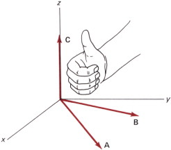
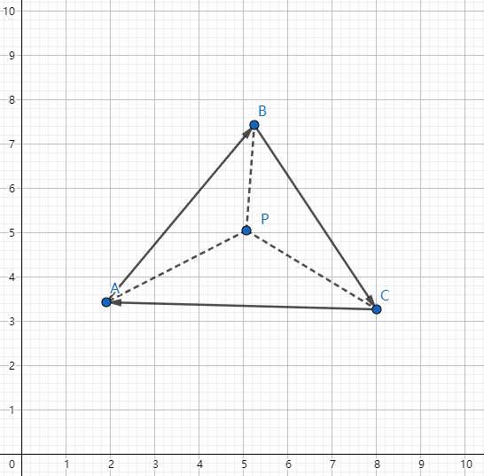

# 图形学的数学基础（四）：向量叉积（Cross Product）

## 叉积

叉积是另一种向量乘积，与上节讲到的点积不同，叉积的结果是一个向量，该向量垂直于原始的两个向量，即垂直于原始两个向量所构成的平面。

## 定义

- $\mathbf{a} \times \mathbf{b}$将产生一个垂直于$\mathbf{a}$和$\mathbf{b}$所构成平面的向量，这样的向量可能有两个，彼此方向相反，朝向由右手螺旋定则判定，具体在后文会详细介绍。

- **$\mathbf{a} \times \mathbf{b}$的长度等于$\mathbf{a}$和$\mathbf{b}$长度的乘积再乘以$\mathbf{a}$和$\mathbf{b}$之间角度的正弦值。**

    $||\mathbf{a} \times \mathbf{b}|| = ||\mathbf{a}|||| \mathbf{b} || \sin\theta$
    
实际上根据定义不难理解， $\mathbf{a} \times \mathbf{b}$的长度等于由两个边$\mathbf{a}$ $\mathbf{b}$所形成的平行四边形的面积。

$\textbf{A} =  bh = b(a\sin\theta) = ||\mathbf{a}||||\mathbf{b}||\sin\theta = ||\mathbf{a} \times \mathbf{b}||$

## 性质

- 叉积交换的，实际上，它是反交换的（anticommutative）的：$\mathbf{a} \times \mathbf{b} = - (\mathbf{b} \times \mathbf{a})$
- 向量自身的叉积等于零向量 $ \mathbf{a} \times \mathbf{a} = \vec{0} $
- 叉积满足分配律：$ \mathbf{a} \times(\mathbf{b} + \mathbf{c}) = \mathbf{a} \times \mathbf{b} + \mathbf{a} \times \mathbf{c} $
- 叉积满足结合律：$ \mathbf{a} \times (k\mathbf{b}) = k(\mathbf{a} \times \mathbf{b})$

## 右手螺旋定则

先将两向量移动到同一起点，右手四指从A转动到B，则拇指所指方向，即为结果向量的方向。
符合右手螺旋定则的坐标系称之为右手坐标系，即 $\vec{x} \times \vec{y} = \vec{z}$,否则为左手系。

$\vec{x} \times \vec{y} = +\vec{z}$

$\vec{y} \times \vec{x} = -\vec{z}$

$\vec{y} \times \vec{z} = +\vec{x}$

$\vec{z} \times \vec{y} = -\vec{x}$

$\vec{z} \times \vec{x} = +\vec{y}$

$\vec{x} \times \vec{z} = -\vec{y}$

## 几何意义

### 判定两向量的相对位置关系

向量叉积可以用于判定两个向量的相对位置关系，比如如果我们想知道一个向量在另外一个的左侧还是右侧，可以通过两个向量叉积结果的符号来判断。

$\mathbf{a} \times \mathbf{b}  = + \mathbf{z}$
因此$\mathbf{b}在\mathbf{a}的左侧$

### 判定点是否在三角形内
分别使用三角形的三边向量 $\vec{AB}$ $\vec{BC}$ $\vec{CA}$，叉乘三角形每个顶点与P点构成的向量，如果得到的三个结果向量方向一致，则认为P点在三角形 $\triangle{ABC}$内,否则P点在三角形外。

$\vec{AB} \times \vec{AP}$

$\vec{BC} \times \vec{BP}$

$\vec{CA} \times \vec{CP}$

### 构造三维直角坐标系

$\vec{x} \times \vec{y} = \vec{z}$

## 参考

[《3D数学基础》图形和游戏开发(第二版)](https://item.jd.com/12659881.html)

[GAMES101 -现代计算机图形学入门-闫令琪](https://www.bilibili.com/video/BV1X7411F744?p=2&vd_source=b3b87210888ec87be647603921054a36)

