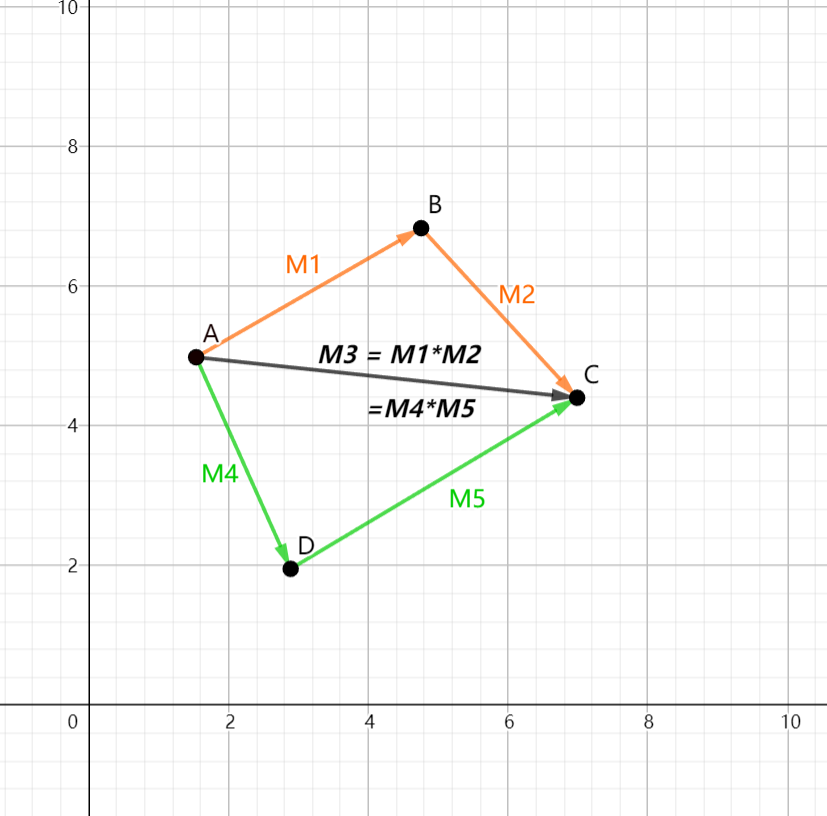
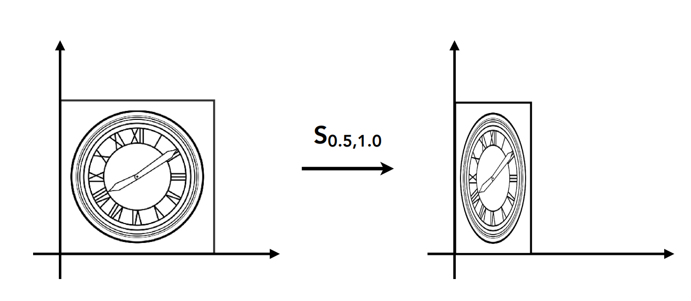
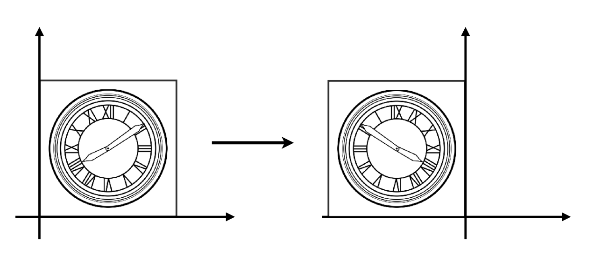
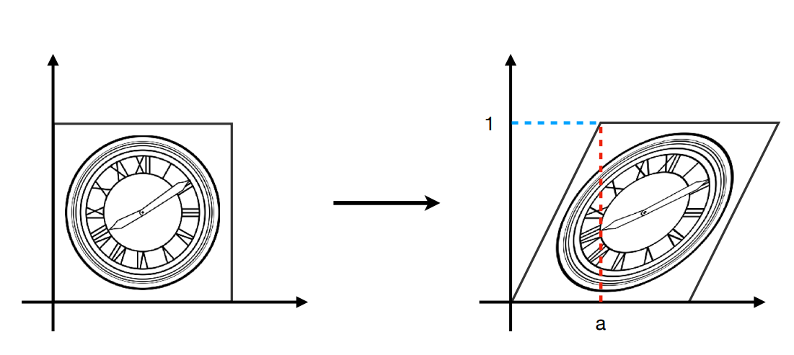

# 图形学的数学基础（四）：矩阵线性变换
我们可以通过将点的坐标加上一个偏移值来实现平移。 我们还可以利用三角函数来旋转一个向量。 简而言之，**矩阵只是将所有这些变换(缩放、旋转、反射、错切、平移)通过统一结构来表达的一种方式。** 通过矩阵可以方便对空间中的点或向量进行各种变换，而不用写一大堆的公式。这就是矩阵为何在图形学中如此重要的原因。**图形学中的任意变换都可以通过一个矩阵完成** 对同一个对象的多次变换可以通过矩阵相乘转换为单个矩阵。如下图：

*注：本文所有推导和公式均使用列向量形式。*

## 线性变换

### 缩放（Scale）

### 沿主轴缩放
最简单的缩放是沿每个轴线应用单独的或均匀缩放。

#### 均匀缩放
保留原始对象的角度和比例， 使被缩放对象统一增大或者减少s因子。

$\begin{bmatrix}x^丶\\y^丶\end{bmatrix} = \begin{bmatrix}S&0\\0&S\end{bmatrix}\begin{bmatrix}x\\y\end{bmatrix}$

同理三维空间中采用以下形式:

$\begin{bmatrix}x^丶\\y^丶\\z^丶\end{bmatrix} = \begin{bmatrix}S&0&0\\0&S&0\\0&0&S\end{bmatrix}\begin{bmatrix}x\\y\\z\end{bmatrix}$

#### 非均匀缩放
如果希望"拉伸"或者"挤压"对象,则可以在不同方向上应用不同的缩放因子，这样会实现非均匀缩放。非均匀缩放不会保留原始对象的比例。

$\begin{bmatrix}x^丶\\y^丶\end{bmatrix} = \begin{bmatrix}S_x&0\\0&S_y\end{bmatrix}\begin{bmatrix}x\\y\end{bmatrix}$

同理三维空间中采用以下形式:

$\begin{bmatrix}x^丶\\y^丶\\z^丶\end{bmatrix} = \begin{bmatrix}S_x&0&0\\0&S_y&0\\0&0&S_z\end{bmatrix}\begin{bmatrix}x\\y\\z\end{bmatrix}$

### 任意方向缩放
除了沿主轴线缩放外，还可以按照任意方向缩放。设$\hat{n}$为缩放方向（缩放沿着$\hat{n}$执行），缩放因子s。以下将逐步实现沿任意方向缩放的方法。

**step1**:  推导表达式，给定任意矢量$\mathbf{v}$，用$\mathbf{v},s,\hat{n}$计算$\mathbf{v^丶}$。基本思路是将矢量$\mathbf{v}$在$\hat{n}$上投影，分解为$\vec{v_∥}和\vec{v_⊥}$。其中$\vec{v_∥}$根据k因子缩放，$\vec{v_⊥}$保持不变。以下为推导过程：

$\vec{v} = \vec{v_∥} + \vec{v_⊥}$

$\vec{v_∥} = (\vec{v}.\hat{n})\hat{n}$

$\vec{v^丶_⊥} = \vec{v_⊥} = \vec{v} - \vec{v_∥} = \vec{v} - (\vec{v}.\hat{n})\hat{n}$

$\vec{v^丶_∥} = s\vec{v_∥} = s(\vec{v}.\hat{n})\hat{n}$

$\vec{v^丶} = \vec{v^丶_⊥} + \vec{v^丶_∥} = \vec{v} - (\vec{v}.\hat{n})\hat{n} + s(\vec{v}.\hat{n})\hat{n} = \vec{v} + (s-1)(\vec{v}.\hat{n})\hat{n}$

**step2**: 既然我们知道了如何缩放任意矢量，则可以计算出缩放后的基矢量值，将原始基矢量$x = \begin{bmatrix}1\\0\end{bmatrix},y = \begin{bmatrix}0\\1\end{bmatrix}$带入上式可得：

$\vec{x^丶} = \vec{x} + (s-1)(\vec{x}.\hat{n})\hat{n}\\\quad\quad= \begin{bmatrix}1\\0\end{bmatrix} + (s-1)(\begin{bmatrix}1\\0\end{bmatrix}.\begin{bmatrix}n_x\\n_y\end{bmatrix}).\begin{bmatrix}n_x\\n_y\end{bmatrix} \\\quad\quad= \begin{bmatrix}1\\0\end{bmatrix} + (s-1)n_x.\begin{bmatrix}n_x\\n_y\end{bmatrix}\\\quad\quad= \begin{bmatrix}1 + (s-1){n_x}^2\\ (s-1)n_xn_y\end{bmatrix}$

$\vec{y^丶} = \begin{bmatrix}(s-1)n_xn_y\\1 + (s-1)(n_y)^2\end{bmatrix}$

推导出二维和三维矢量空间沿任意方向$\hat{n}$缩放s的矩阵为：

$\textbf{Scale}^2(\hat{n},s) = \begin{bmatrix}1 + (s-1)(n_x)^2&&(s-1)n_xn_y\\  (s-1)n_xn_y&&1+(s-1){n_y}^2\end{bmatrix}$

$\textbf{Scale}^3(\hat{n},s) = \begin{bmatrix}1 + (s-1)(n_x)^2&&(s-1)n_xn_y&&(s-1)n_xn_z\\ (s-1)n_xn_y&&1+(s-1){n_y}^2&&(s-1)n_yn_z\\ (s-1)n_xn_z&&(s-1)n_yn_z&&1+(s-1){n_z}^2\end{bmatrix}$

### 反射（Reflection）
**反射其实是一种特殊的缩放，即按照某个轴线执行-1缩放。**

#### 沿主轴反射

$\begin{bmatrix}x^丶\\y^丶\end{bmatrix} = \begin{bmatrix}-1&0\\0&1\end{bmatrix}\begin{bmatrix}x\\y\end{bmatrix}$

#### 沿任意轴反射
根据沿任意轴缩放得到的矩阵公式，将-1带入，可得沿任意轴反射的矩阵公式：

$\textbf{Reflection}^2(\hat{n}) = \begin{bmatrix}1 + (-1-1)(n_x)^2&&(-1-1)n_xn_y\\ (-1-1)n_xn_y&&1+(-1-1){n_y}^2\end{bmatrix}$

$\textbf{Reflection}^3(\hat{n}) = \begin{bmatrix}1 + (-1-1)(n_x)^2&&(-1-1)n_xn_y&&(-1-1)n_xn_z\\ (-1-1)n_xn_y&&1+(-1-1){n_y}^2&&(-1-1)n_yn_z\\ (-1-1)n_xn_z&&(-1-1)n_yn_z&&1+(-1-1){n_z}^2\end{bmatrix}$

### 错切（Shaearing）
错切是一种“倾斜”坐标空间的变形。它将不均匀的拉伸空间，不保留角度。但是保留面积和体积。基本思路是将一个坐标的倍数添加到另一个坐标上。

$\begin{bmatrix}x^丶\\y^丶\end{bmatrix} = \begin{bmatrix}1&a\\0&1\end{bmatrix}\begin{bmatrix}x\\y\end{bmatrix}$

二维错切矩阵公式：

$\textbf{H}_x(s) = \begin{bmatrix}1&s\\0&1\end{bmatrix}$ (沿x轴方向拉拽)

$\textbf{H}_y(s) = \begin{bmatrix}1&0\\s&1\end{bmatrix}$ (沿y轴方向拉拽)

三维错切矩阵公式：

$\textbf{H}_{xy}(s,t) = \begin{bmatrix}1&0&0\\0&1&0\\s&t&1\end{bmatrix}$

$\textbf{H}_{xz}(s,t) = \begin{bmatrix}1&0&0\\s&1&t\\s&t&1\end{bmatrix}$

$\textbf{H}_{yz}(s,t) = \begin{bmatrix}1&s&t\\0&1&0\\s&t&1\end{bmatrix}$

### 旋转（Rotation）

#### 二维空间绕原点的旋转
在二维空间中只能绕点旋转，本小节公式和实例将旋转点限定为坐标系原点（绕任意点的旋转需要先平移 再旋转 再平移回去，涉及到齐次坐标，暂不讨论）。
定义二维空间中旋转角度为$\theta$，根据三角函数的定义可知，基向量$\vec{x},\vec{y}$绕原点旋转后得到$\vec{x^丶},\vec{y^丶}$如下图所示：

$\textbf{R}(\theta) = \begin{bmatrix}\cos\theta&-\sin\theta\\\sin\theta&\cos\theta\end{bmatrix}$

#### 三维空间绕主轴线的旋转
和二维不同，三维旋转是绕某个轴线进行的。本小节将介绍围绕主轴线（$\mathbf{x}，\mathbf{y}，\mathbf{z}$）的旋转.
和缩放矩阵的推导类似，首先对三个基向量变换,以围绕$\mathbf{x}$轴旋转为例：

**step1**：对基向量应用旋转变换：

$\mathbf{x^丶} =  \mathbf{x} = \begin{bmatrix}1\\0\\0\end{bmatrix}$

$\mathbf{y^丶} = \begin{bmatrix}0\\\cos\theta\\\sin\theta\end{bmatrix}$

$\mathbf{z^丶} = \begin{bmatrix}0\\ -\sin\theta\\\cos\theta\end{bmatrix}$

**step2**:组合基向量形成旋转矩阵：

$\textbf{R}_x(\theta) = \begin{bmatrix}1&0&0\\0&\cos\theta&-\sin\theta\\0&\sin\theta&\cos\theta\end{bmatrix}$

同理可推导出沿$\mathbf{y},\mathbf{z}$轴的旋转矩阵公式如下：

$\textbf{R}_y(\theta) = \begin{bmatrix}\cos\theta&0&\sin\theta\\0&1&0\\ -\sin\theta&0&\cos\theta\end{bmatrix}$

$\textbf{R}_z(\theta) = \begin{bmatrix}\cos\theta&-\sin\theta&0\\\sin\theta&\cos\theta&0\\0&0&1\end{bmatrix}$

#### 三维空间绕任意轴的旋转

让我们推导出一个围绕$\hat{n}$旋转$\theta$角度的矩阵$\textbf{R}(\hat{n},\theta)$,使得当矩阵$\textbf{R}(\hat{n},\theta)$乘以矢量$\mathbf{v}$得到的矢量$\mathbf{v^丶}$是将$\mathbf{v}$围绕$\hat{n}$旋转$\theta$角度的结果.

$\mathbf{v^丶} = \textbf{R}(\hat{n},\theta)\mathbf{v}$

**推导思路**

1. 为了得到矩阵$\textbf{R}(\hat{n},\theta)$,需要用$\mathbf{v}, \hat{n}, \theta$来表达$\mathbf{v^丶}$,基本思路是解决垂直于$\hat{n}$的平面中的问题,为此,将$\mathbf{v}$分解为$\mathbf{v_∥}和\mathbf{v_⊥}$两个矢量,分别平行和垂直于单位矢量$\hat{n}$.通过单独旋转每个分量,剋将矢量作为一个整体旋转.即: $\mathbf{v^丶} = \mathbf{v_∥^丶} + \mathbf{v_⊥^丶}$.
2. 由于$\mathbf{v_∥}$与$\hat{n}$平行,因此它不受旋转影响.即: $\mathbf{v^丶_∥} = \mathbf{v_∥}$
3. 根据矢量的投影计算可得: $\mathbf{v_∥} = (\mathbf{v}.\hat{n})\hat{n}$     $\mathbf{v_⊥} = \mathbf{v} - \mathbf{v_∥}$
4. 利用矢量叉积构造$\mathbf{w}$: $\mathbf{w} = \hat{n}\times\mathbf{v_⊥} = \hat{n}\times\mathbf{v}$
5. 注意上图所示,矢量$\mathbf{w}和\mathbf{v_⊥}$构成了一个二维空间.$\mathbf{v_⊥}$作为x轴,$\mathbf{w}$作为y轴.$\mathbf{v^丶_⊥}$是在这个平面上按角度$\theta$旋转$\mathbf{v_⊥}$的结果.

**推导过程**

$\mathbf{v_∥} = (\mathbf{v}.\hat{n})\hat{n}$

$\mathbf{v_⊥} = \mathbf{v} - \mathbf{v_∥} = \mathbf{v} - (\mathbf{v}.\hat{n})\hat{n}$

$\mathbf{w} = \hat{n}\times\mathbf{v_ ⊥} = \hat{n}\times\mathbf{v}$

$\mathbf{v^丶_⊥} = \cos\theta\mathbf{v_⊥} + \sin\theta\mathbf{w} = \cos\theta(\mathbf{v} - (\mathbf{v}.\hat{n})\hat{n}) + \sin\theta(\hat{n}\times\mathbf{v})$

$\mathbf{v^丶} = \mathbf{v^丶_⊥} + \mathbf{v_∥} = \cos\theta(\mathbf{v} - (\mathbf{v}.\hat{n})\hat{n}) + \sin\theta(\hat{n}\times\mathbf{v}) + (\mathbf{v}.\hat{n})\hat{n}$

接下来,计算变换后的基向量，简单带入上式即可.

$\mathbf{x^丶} = \begin{bmatrix}{n_x}^2(1-\cos\theta) + \cos\theta\\{n_x}{n_y}(1-\cos\theta)+{n_z}\sin\theta\\{n_x}{n_z}(1-\cos\theta)-{n_y}\sin\theta\end{bmatrix}$

$\mathbf{y^丶} = \begin{bmatrix}{n_x}{n_y}(1-\cos\theta) - {n_z}\sin\theta\\{n_y}^2(1-\cos\theta)+\cos\theta\\{n_y}{n_z}(1-\cos\theta)+{n_x}\sin\theta\end{bmatrix}$

$\mathbf{z^丶} = \begin{bmatrix}{n_x}{n_z}(1-\cos\theta) + {n_y}\sin\theta\\{n_y}{n_z}(1-\cos\theta)-{n_x}\sin\theta\\{n_z}^2(1-\cos\theta)+\cos\theta\end{bmatrix}$

通过变换后基矢量的简单组合,即可构造出旋转矩阵

$\textbf{R}(\hat{n},\theta) = \begin{bmatrix}|&|&|\\ \mathbf{x^丶}&\mathbf{y^丶}&\mathbf{z^丶}\\ |&|&|\end{bmatrix} = \begin{bmatrix}{n_x}^2(1-\cos\theta) + \cos\theta&{n_x}{n_y}(1-\cos\theta) - {n_z}\sin\theta&{n_x}{n_z}(1-\cos\theta) + {n_y}\sin\theta\\{n_x}{n_y}(1-\cos\theta)+{n_z}\sin\theta&{n_y}^2(1-\cos\theta)+\cos\theta&{n_y}{n_z}(1-\cos\theta)-{n_x}\sin\theta\\{n_x}{n_z}(1-\cos\theta)-{n_y}\sin\theta&{n_y}{n_z}(1-\cos\theta)+{n_x}\sin\theta&{n_z}^2(1-\cos\theta)+\cos\theta\end{bmatrix}$.

至此绕任意轴的三维旋转矩阵推导完毕.

## 仿射变换和齐次坐标

上一节中我们讨论了很多利用矩阵变换向量的例子，在二维空间中这些变换具有以下形式：

$\mathbf{x^丶} = m_{11}\mathbf{x} + m_{12}\mathbf{y}$

$\mathbf{y^丶} = m_{21}\mathbf{x} + m_{22}\mathbf{y}$

这种形式的变换都满足矩阵中某个元素和x，y的线性组合，原点(0,0)在线性变换下始终保持不变，这种变换我们称为“**线性变换**”。但无法通过这种方式实现平移。平移只能添加额外的表达式，无法在一个矩阵中完成。如下：

$\begin{bmatrix}
    x^丶\\ y^丶
\end{bmatrix}$ = $\begin{bmatrix}
    a&b\\ c&d
\end{bmatrix}$ $\begin{bmatrix}
    x\\ y
\end{bmatrix}$ + $\begin{bmatrix}
    t_x\\ t_y
\end{bmatrix}$

这种变换方式称为“**仿射变换($Affine Transformations$)**”。简而言之就是“线性变换” + “平移”。这种方式存在的问题就是写法过于繁琐，不简洁，无法在一个矩阵中完成。因此引入了“齐次坐标”的概念。

### 齐次坐标（Homogenous Coordinates）
无法通过$\begin{bmatrix}x\\ y\end{bmatrix}$乘以一个2 × 2的矩阵来实现平移。 一个在线性变换矩阵中加入平移的可能性方案是简单地将一个单独的平移列添加到变换矩阵中，让矩阵负责缩放和旋转而平移列负责平移操作。

这样就可以通过一次简单的矩阵乘法完成所有变换操作。方法是将点$\begin{bmatrix}x\\ y\end{bmatrix}$增加额外的维度（$\mathbf{w}$分量）$\begin{bmatrix}x\\ y\\ 1\end{bmatrix}$来表达。矩阵增加额外的一列用于表示平移，这样平移分量和x y的线性关系完全独立出来了。

$\begin{bmatrix}
    x^丶\\  y^丶\\ 1
\end{bmatrix}$ = $\begin{bmatrix}
    m_{11}&m_{12}&t_x\\ m_{21}&m_{22}&t_y\\ 0&0&1
\end{bmatrix}\begin{bmatrix}x\\ y\\ 1\end{bmatrix}$ = $\begin{bmatrix}
    m_{11}x + m_{12}y + t_x\\ m_{21}x + m_{22}y + t_y\\ 1
\end{bmatrix}$.

这个单一的矩阵实现了一个线性变换 + 平移。这种变换叫做仿射变换，这种  
通过添加额外维度实现仿射变换的方法被称为齐次坐标（(Roberts, 1965; Riesenfeld, 1981; Penna & Patterson,1986）。

当我们需要变换的是向量时，表示方向或偏移量的向量不应该改变，可以简单的将$\mathbf{w}$分量设置为0.  

$\begin{bmatrix}
    1&0&t_x\\ 0&1&t_y\\ 0&0&1
\end{bmatrix}\begin{bmatrix}x\\ y\\ 0\end{bmatrix} = \begin{bmatrix}x\\ y\\ 0\end{bmatrix}$.

因此齐次坐标对于向量和点有不同的表达方式，向量的$\mathbf{w}$分量为0，而点的$\mathbf{w}$分量为1.

1. $vector$: $\begin{bmatrix}x\\ y\\ 0\end{bmatrix}$

2. $pointer$: $\begin{bmatrix}x\\ y\\ 1\end{bmatrix}$

### 齐次坐标的几何解释

接下来让我们从几何的视角观察齐次坐标代表的含义。  
当在三维空间中做基于$z$的切变时，我们会得到如下形式：

$\begin{bmatrix}1&0&t_x\\ 0&1&t_y\\ 0&0&1\end{bmatrix}\begin{bmatrix}x\\ y\\ z\end{bmatrix} = \begin{bmatrix}x+{t_x}z\\ y+{t_y}z\\ z\end{bmatrix}$.

这种形式和我们在二维空间中做平移变换非常相似。仅仅是z所代表的含义不同。关键点来了，让我们把z设为1.得到了二维平移仿射变换：

$\begin{bmatrix}1&0&t_x\\ 0&1&t_y\\ 0&0&1\end{bmatrix}\begin{bmatrix}x\\ y\\ 1\end{bmatrix} = \begin{bmatrix}x+{t_x}\\ y+{t_y}\\ 1\end{bmatrix}$.

**结论：低维度的仿射变换($$Affine\;Transformations$$)可以被认为是高纬度的错切变换($Shearing\;Transformations$)**

## 引用
[《3D数学基础》图形和游戏开发(第二版)](https://item.jd.com/12659881.html)

[GAMES101 -现代计算机图形学入门-闫令琪](https://www.bilibili.com/video/BV1X7411F744?p=3&vd_source=b3b87210888ec87be647603921054a36)

[scratchapixel](https://www.scratchapixel.com/)

