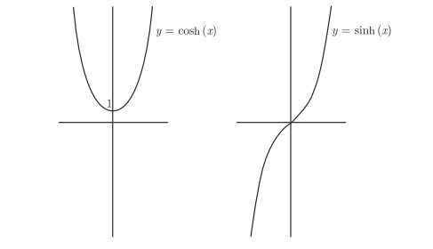

# 基础知识

## 指数法则

> 1. $b^0=1$
> 
> 2. $b^1=b$
> 
> 3. $b^xb^y=b^{x+y}$
> 
> 4. $\frac{b^x}{b^y}=b^{x-y}$
> 
> 5. $(b^x)^y=b^{xy}$

## 对数法则

> 1. $b^{\log_by}=y$
> 
> 2. $\log_b1=0$
> 
> 3. $\log_bb=1$
> 
> 4. $\log_b{(xy)}=\log_bx+\log_by$
> 
> 5. $\log_b(\frac{x}{y})=\log_bx-\log_by$
> 
> 6. $\log_b(x^y)=y\log_bx$
> 
> 7. $\log_bx=\frac{\log_cx}{\log_cb}$
>
> 8. $\log_xy=\frac{1}{\log_yx}$

## e

关于e的四个定义:
> $\lim_{h \to \infty}(1+\frac{r}{h})^h=e^r$
>
> $\lim_{h \to 0}(1+rh)^{\frac{1}{h}}=e^r$
>
> $\lim_{h \to \infty}(1+\frac{1}{h})^h=e$
> 
> $\lim_{h \to 0}(1+h)^{\frac{1}{h}}=e$
# 对数函数和指数函数求导

## 对数函数和指数函数求导

$令f(x)=\log_bx$

根据导数定义可知

$f'(x)=\lim_{h \to 0}\frac{\log_b(x+h)-\log_bx}{h}$

$f'(x)=\lim_{h \to 0}\frac{1}{h}(\log_b(\frac{x+h}{x}))$

$f'(x)=\lim_{h \to 0}\log_b((\frac{x+h}{x})^{\frac{1}{h}})$

$f'(x)=\lim_{h \to 0}\log_b((1+\frac{h}{x})^{\frac{1}{h}})$

$f'(x)=\log_b(e^{\frac{1}{x}})=\frac{1}{x}\log_be=\frac{1}{x\ln_b}$

以上可以推导出
> $\frac{\mathrm{d}}{\mathrm{d}x}\log_bx=\frac{1}{x\ln_b}$
> 
> $\frac{\mathrm{d}}{\mathrm{d}x}\ln_x=\frac{1}{x}$
>
> $\frac{\mathrm{d}}{\mathrm{d}x}b^x=b^x\ln_b$
>
> $\frac{\mathrm{d}}{\mathrm{d}x}e^x=e^x$

# 对数函数和指数函数的极限

# 取对数求导法
$处理像f(x)^{g(x)}这种底数和指数均有x的函数的导数问题时,取对数求导法是个很有用的技巧.$

$令f(x)=x^x,根据对数法则$

$\ln_(x^x)=x\ln_x=\ln_y$

$\frac{\mathrm{d}}{\mathrm{d}x}\ln_y=\ln_x+x\frac{1}{x}$

$\frac{1}{y}\frac{\mathrm{d}y}{\mathrm{d}x}=\ln_x+1$

$\frac{\mathrm{d}y}{\mathrm{d}x}=(\ln_x+1)x^x$

# 指数增长和指数衰变

## 指数增长
假设$y=e^{kx}$,那么$\frac{\mathrm{d}y}{\mathrm{d}x}=ke^{kx}=ky$
> 如果$\frac{\mathrm{d}y}{\mathrm{d}x}=ky,那么y=Ae^{kx},其中A为某个常数$

这意味着,y的变化率等于ky.一个量变化的速率取决于这个量的大小.如果这个量越大, 那么它就会增长得越快(假设 k > 0).

> 指数增长方程: $P(t)=P_0e^{kt},其中P_0是初始的总数,k是增长常数$

## 指数衰变

> 指数衰变方程: $P(t)=P_0e^{-kt}$

# 双曲函数

## 双曲余弦函数 双曲正弦函数

> $coshx=\frac{e^x+e^{-x}}{2}$
>
> $sinhx=\frac{e^x-e^{-x}}{2}$
>
> $cosh^2(x)-sinh^2(x)=1$
>
> $\frac{\mathrm{d}}{\mathrm{d}x}sinhx=coshx$
>
> $\frac{\mathrm{d}}{\mathrm{d}x}coshx=sinhx$
