为了使物体看起来更有立体感,可以对其使用作色,也就是说使物体表面"涂上"光线,有明暗变化.本章展示了最通用的具有启发式的作色方法.前两个将介绍Lambertian Shading Model和Phong Shading Model, 发明于1970年代,在大多数图形API中都可以使用.最后一个介绍 artistic shading Model,模拟了人类绘制图像的风格.

# Diffuse Shading
许多物体的表面外观被粗略地描述为“哑光”，这表明该物体根本没有光泽。例如纸张、未打磨的木材和干燥、未打磨的石头。在很大程度上，这些物体表面的颜色不会随着视角的变化而变化。例如，如果你盯着一张纸上的一个特定的点，并且在移动的同时保持你的目光在这个点上，这个点上的颜色将保持相对不变。这样的哑光物体可以被认为是表现为朗伯反射体。本节讨论如何实现这样的着色.关键的一点是，本章中的所有公式都应该在世界坐标中求值，而不是在应用了透视变换的坐标中求值。否则，法线之间的角度将改变，着色将是不准确的.

##  Lambertian Shading Model
Lambertian object遵循***Lambert’s cosine law***，即表面的颜色c与表面法线与光源方向夹角的余弦成正比(Gouraud, 1971):
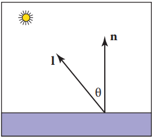
```
c ∝ cosθ  
c ∝ n·l
```
其中n和l如上图所示。因此，表面颜色将根据表面法线与光方向之间夹角余弦而变化。注意，通常假设向量l不依赖于对象的位置。这个假设是说相对于物体大小光是“遥远的”。这样的光通常被称为方向光，因为它的位置仅由一个方向来指定。
通过改变光源的强度或物体表面的反射率，可以使表面变亮或变暗。漫反射系数cr是光被表面反射的因子。这个系数对于rgb三个颜色分量是不同的。因此不同材质物体的漫反射颜色是不同的.例如，如果一个表面反射的红色入射光比蓝色入射光多，那么它就是红色的。如果我们假设表面颜色与从表面反射的光成比例，改进以上公式,加入漫反射系数cr和光照强度cl
```
c ∝ cr cl n·l
```
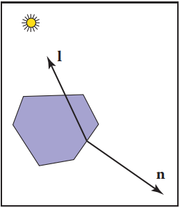
以上公式存在一个问题,当物体表面法线与光照方向相反,点积为负,加入max函数来避免这种情况
```
c ∝ cr cl max(0, n·l)   
```

##  Ambient Shading
漫反射着色的一个问题是，任何表面法线与光源法线相反的表面将是黑色的。在现实生活中，光被反射到各处，有些光从各个方向反射.解决这个问题的一种方法是使用几个光源。一个常见的技巧是在视角处放置一个昏暗的光源，这样所有可见的点都能收到一些光。另一种方法是使用双面照明。一种更常见的方法是添加一个环境光常量(Gouraud, 1971)。
```
 = cr (ca + cl max (0, n · l))
```

# Phong Lighting Model
仅仅有diffuse Shading无法体现物体的高光特性.Phong Lighting Model引入了高光的概念.高光随着视点的移动而在表面上移动。这意味着我们必须在光照方程中加入一个单位向量e，指向眼睛。如果你仔细观察高光，你会发现它们实际上是光的反射;有时这些反射是模糊的。这些高光的颜色是光的颜色.
定义观测向量e,光线的反射向量r.e与e之间的夹角越小则高光越强.因此 c = cl(e · r)
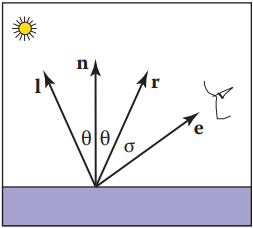
以上方程存在两个问题:
1. 向量的点乘可能为负值,需要用max约束. c = cl max(e . r)
2. 以上方程生成的高光区域比实际的要大得多,可以在不降低最大颜色的情况下通过提高幂来收窄它 c = clmax(0, e · r)^p
这里p被称冯氏指数;它是一个正数(Phong, 1975)。改变冯氏指数对高光辐射面积的影响如下图所示:
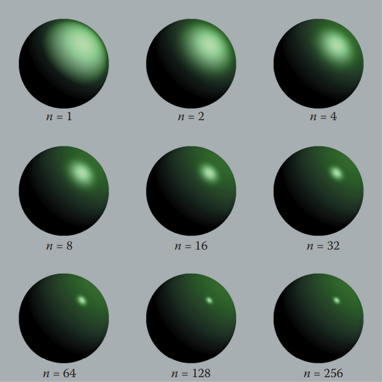

## 计算方式一: 求反射向量r
为了实现方程，我们首先需要计算单位向量r。给定单位向量l和n, r为向量l关于n的反射,公式如下:
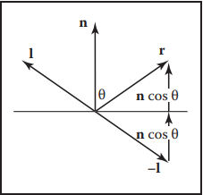
```
r = −l + 2(l · n)n
```

## 计算方式二: 半程向量
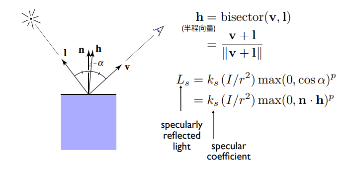

# 完整的Blinn-Phong 反射模型
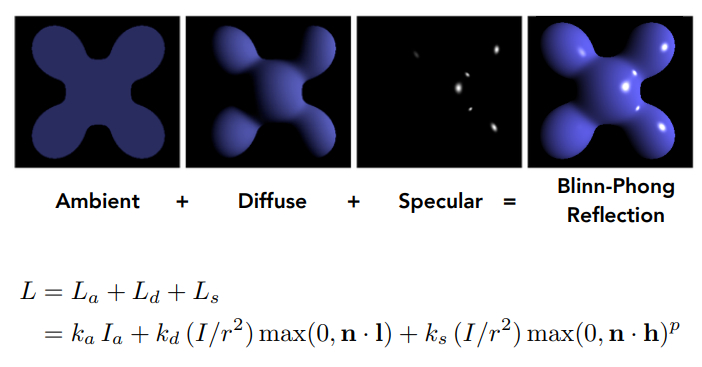

# 着色频率
## Flat Shading
利用三角形法线,每个三角形计算一次着色,通常会呈现为多面的外观,对于曲面物体表现力不是很好.
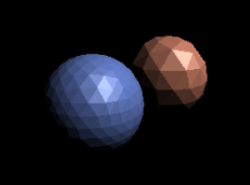
## Gouraud Shading
每个三角形顶点计算一次着色,三角形内部像素通过重心坐标插值计算颜色.问题在于如何获取或计算顶点法线?
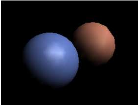

### 定义逐顶点法线
可以通过各种启发式方法计算法线。最简单的方法是将共享每个顶点的三角形的法线求平均然后在顶点处使用这个平均法线。这个平均法线没有经过标准化，所以在使用它做着色之前需要把它转换成一个单位向量。

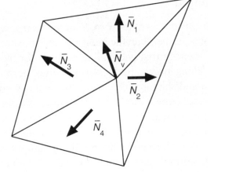
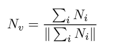
## Phong Shading
首先计算每个顶点的法线,通过重心坐标插值计算三角形内部每个像素的法线,每个像素计算一次着色.性能最低但是效果最好.

## 三种着色频率对比
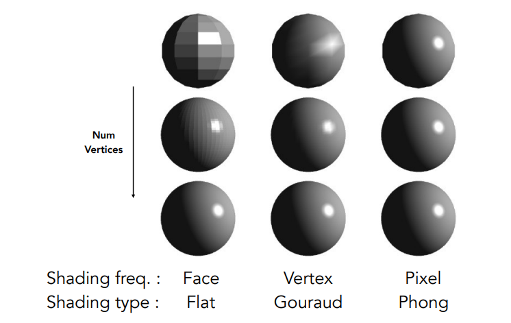