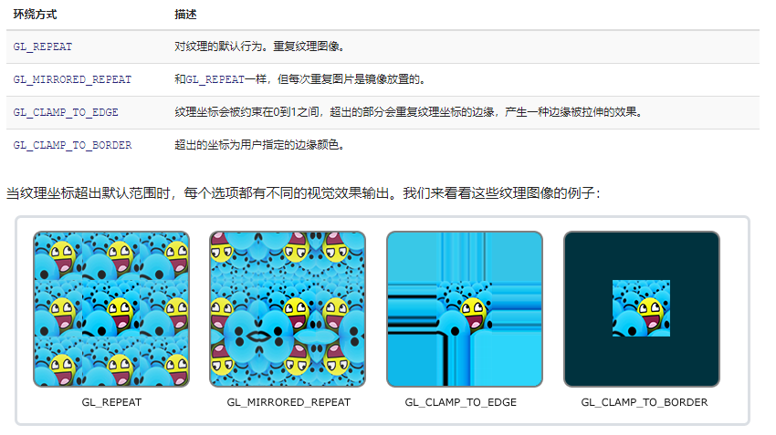

&nbsp;&nbsp;&nbsp;&nbsp;当试图重现真实世界的样貌时，人们很快就会意识到任何物体都有自己的特征。木材随纹理生长;皮肤长出皱纹;布显示其编织结构;油漆显示了刷子或辊子留下的痕迹。即使是光滑的塑料也是用模压成型的凸起物制成的，而光滑的金属则显示出制造它的加工过程的痕迹。曾经毫无特色的材料很快就会被标记、凹痕、污渍、划痕、指纹和污垢所覆盖.
&nbsp;&nbsp;&nbsp;&nbsp;在图形学中,我们把所有这些现象归结为"空间性的改变物体属性"- 物体表面属性因位置而异，但并不真正改变物体形状几何构造.为了实现这些效果，所有类型的建模和渲染系统都提供了一些纹理映射的方法:使用称为纹理映射的图像、纹理图像或者纹理来存储数据, 然后通过数学的方法将图片映射到物体表面.
&nbsp;&nbsp;&nbsp;&nbsp;事实证明,除了表现物体表面细节的基本目的外，还有许多其他应用纹理映射的方式.例如:生成阴影(shadow mapping), 反射, 提供光照(Environment mapping),甚至定义形状(bump mapping).
本章讨论通过纹理来表示表面细节、阴影和反射。虽然基本思想简单，但仍然面临几个问题需要处理.
1. 实现从纹理到物体表面的映射函数.
2. 纹理映射是一个重采样的过程,就像重新调整一张图片的大小, 重采样会产生走样问题.

# 纹理查询
&nbsp;&nbsp;&nbsp;&nbsp;首先，让我们考虑一个简单的纹理映射应用。我们有一个木地板的场景，我们希望地板的漫反射颜色是由一个木地板木纹图像控制。无论我们使用光线追踪或光栅化,着色代码需要知道当前作色点对应的纹理图片的颜色值,用作布林冯光照模型中的漫反射颜色系数.
为了拿到着色点对应纹理图片的颜色值, 着色器会执行一次纹理查询(***texture lookup***)-它计算在纹理图像的坐标系统中，对应于着色点的位置，然后读取图像中的颜色，从而得到纹理样本.这种颜色随后被用于着色.伪代码如下:
```
Color texture_lookup(Texture t, float u, float v) {
    int i = round(u * t.width() - 0.5)
    int j = round(v * t.height() - 0.5)
    return t.get_pixel(i,j)
}
Color shade_surface_point(Surface s, Point p, Texture t) {
    Vector normal = s.get_normal(p)
    (u,v) = s.get_texcoord(p)
    Color diffuse_color = texture_lookup(u,v)
    // compute shading using diffuse_color and normal
    // return shading result
}
```


# 纹理坐标方程

## 平铺, 环绕方式, 纹理坐标变换

模型的纹理坐标不总是在[0,1]的区间内,纹理映射机制有不同的处理方式.
如果一张纹理被设计只覆盖部分表面，但纹理坐标已经设置好将整个表面映射到单元正方形，其中一种方式是准备一个几乎是空白的纹理图像，其中的内容位于一个小区域。
但这可能需要非常高分辨率的纹理图像来获得相关区域的足够细节。另一种做法是缩放所有纹理坐标，使它们覆盖更大的范围，例如，到位置在表面中心面积为十分之一的正方形单位。
在这种情况下，纹理覆盖的单元正方形区域之外的纹理查找应该返回一个固定的背景色。一种方法是设置一个背景色，由单元正方形外的纹理查找返回。如果已经有一个恒定的背景颜色纹理图像(例如,一个标志在白色背景),另一种方法是返回纹理图像的颜色最接近边缘的颜色.
有时我们想要一个重复的图案，比如棋盘，瓷砖地板，或砖墙。如果可以使图案在矩形网格上重复，那么使用相同数据的许多副本创建图像将是一种浪费。相反，我们可以使用环绕索引处理纹理图像外部的纹理查找—当查找点离开纹理图像的右边缘时，它会绕到左边缘。使用像素坐标上的整数余数操作可以非常简单地处理这个问题。
```
//repeat
Color texture_lookup_wrap(Texture t, float u, float v) {
int i = round(u * t.width() - 0.5)
int j = round(v * t.height() - 0.5)
return t.get_pixel(i % t.width(), j % t.height())
}


//clamp 
Color texture_lookup_wrap(Texture t, float u, float v) {
int i = round(u * t.width() - 0.5)
int j = round(v * t.height() - 0.5)
return t.get_pixel(max(0, min(i, t.width()-1)),
(max(0, min(j, t.height()-1))))
}
```
以上是纹理查询在越界查找时的两种不同规则,具体选择哪种由纹理的环绕方式指定,环绕方式包含平铺,约束以及两者的各种组合和变体构成.拿openGL来说,wrapMode有以下四种方式:


## 透视矫正插值

# 抗锯齿


 
