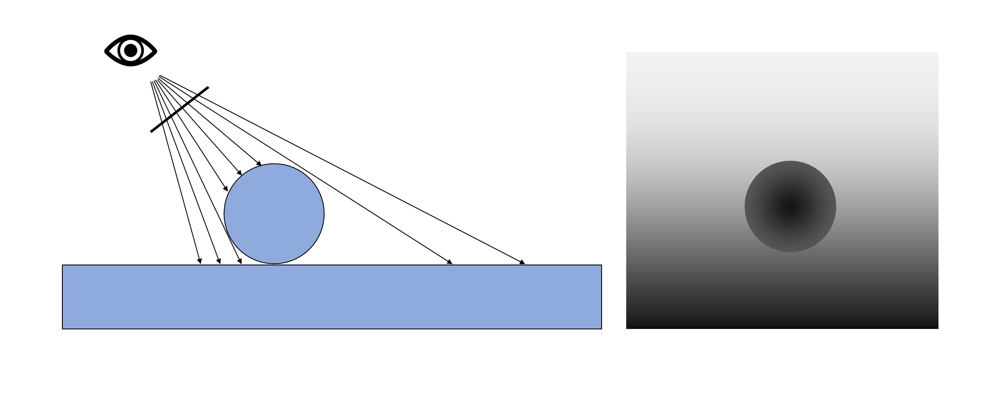
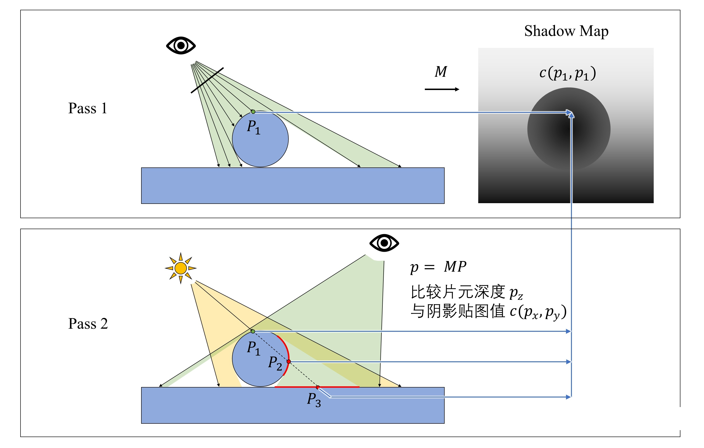
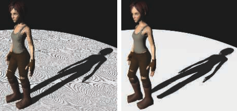
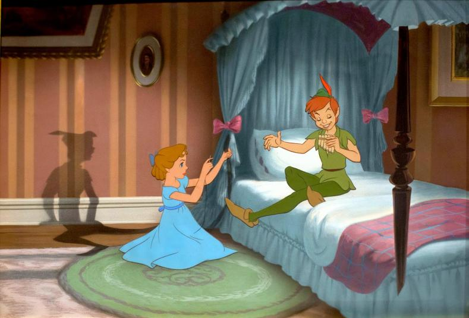
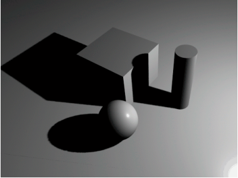

# 计算机图形学（七）：阴影

> All the variety, all the charm, all the beauty of life is made up of light and shadow      - Tolstoy

阴影对于表达场景真实感极其重要，因为它能够提供物体在空间中的相对位置关系，使物体看起来不是**漂浮**在空中的。本章将重点介绍计算阴影理论以及在光栅化中实时阴影算法。


>《古墓丽影-暗影》 2018

之前介绍$blinn-Phong\;Model$光照模型是**局部的**，仅考虑光线 着色点 视线三个因素，不考虑其它物体对于当前着色点的影响，例如遮蔽，阴影等，而现实情况是，光照是及其复杂的，需要考虑周围物体对着色点的影响（间接光照），而在传统的局部着色（直接光照）中很难实现准确的表达，往往需要通过其它技术近似的模拟，今天介绍的$shadow\;Mapping$就是其中之一。一种在光栅化成像中实现阴影的技术。

## $Shadow\;Mapping$
它是一种图像空间（$Image-Space$）算法。核心思想就是：**那么一个着色点既可以被摄像机看到也可以被光源看到，那么该点不在阴影里。如果一个着色点在阴影里，那么摄像机可以看到，光源是看不到的。**

传统的$Shadow\;Mapping$只能处理点光源，这样的阴影都有明显的边界和锯齿，一个着色点要么在阴影里，要么不在，缺少了中间柔和的过渡。这种阴影我们称之为**硬阴影**。

### 实现方法
回顾$zBuffer$算法，$zBuffer$实际上是一张二维纹理贴图，每一个纹素记录了距离相机最近的片元深度：


-  step1：那么自然的，我们可以先将摄像机移动到光源位置和方向，**看向**场景，渲染一张深度图，这张深度图就代表了哪些着色点可以被光源**照亮**，大于这个深度的片元都是在阴影中的，这个阶段需要做两件事情，1：渲染深度图（$Shadow\;Mapping$），2：记录相机变换到光源位置的变换矩阵$M$：



> 光照方向深度图

- step2：将相机摆放到正常的观测方向和位置，对片元进行着色时，考虑每个片元是否有光照，方式是：用步骤1中存储的矩阵$M$将当前着色点变换到光照空间，拿到在光照空间中当前着色点$p$的深度，然后采样$Shadow\;Mapping$中对应的当前点的最小深度，对比两者，如果着色点$p$的深度大于纹理采样得到的深度，则认为当前片元被遮挡，需要在光照计算中加入shadow因子。

- step3：通过以上两个步骤可以看出，一个pass无法完成$shadow\;Map$的阴影渲染，需要两个pass，第一个pass负责渲染深度图（不渲染到屏幕，渲染到一张纹理中），第二个pass对场景正常渲染，整体过程如下图所示：



## $Shadow\;Mapping$存在的问题
阴影贴图的一个劣势是生成阴影的质量严重依赖于阴影贴图的分辨率和$zBuffer$的浮点数精度，由于阴影图是在比较深度时进行采样的，因此算法容易出现混叠问题。一个常见的现象就是自遮挡（$surface\;acne\;or\;shadow\;acne$）：



造成这种奇怪现象的原因有两个。第一：受限于处理器浮点数精度。第二：阴影图受限于它的分辨率，阴影图中一个纹素可能会覆盖离光源位置较远的多个片元。如下图很清晰的解释了分辨率造成$shadow\;acne$问题的原因：


上图中每个黄色的倾斜面板代表深度图中的单个纹素，几个片段对相同的深度样本进行了采样。正常情况下这是没问题的，但当光源以某个角度朝向平面时，问题就开始出现了，因为这个时候，我们生成的深度图也是从同样的倾斜角度渲染的。进行深度比较时，一些片元将得到相同倾斜深度纹理像素，这样就造成了一部分片元深度高于当前纹素值（倾斜的黄色面包那），一些低于当前纹素值。形成了条纹状类似于摩尔纹的现象。

明白了原理后，问题解决就变得简单了，可以引入一个常数偏移，一般称为$Shadow\;bias$,在进行深度比较时，从深度图采样得到的数值中加上这样一个偏移量，这样就可以避免倾斜面板（单个纹素）与共享同一纹素深度的几个片元形成区域的相交：


同样我们也可以发现，当光线与平面夹角越小，这种走样现象表现的越明显，**因为夹角越小，同一纹素覆盖的像素范围更大**。因此常数的$Shadow\;bias$是不可靠的，因为需要额外弥补的偏移量并不是一个常数，而是与光线入射角度相关的。更加通用的做法是，求着色点法线和和光线的点积，实现动态bias：

```
    float bias = max(0.05 * (1.0 - dot(normal, lightDir)), 0.005);
```

但是引入$Shadow\;bias$会带来另外一个问题，当我们应用一个bias偏移到物体的实际深度后，如果偏差很大，则会看到阴影与实际物体位置偏差比较大：


这种现象俗称$Peter\;panning$:



解决这个问题很简单，只需要在渲染阴影图时开启正面剔除即可，以OpenGL为例：

```
    glCullFace(GL_FRONT);
    RenderSceneToDepthMap();
    glCullFace(GL_BACK);
```

## 硬阴影 vs 软阴影


明显可以看出软阴影没有明显的阴影边界，过渡自然，更符合自然中观察到的实际情况。而基于之前介绍的一系列方法是无法实现右侧图所示的软阴影的。

因为日常中我们所见到的绝大多数都是面光源，生成的阴影包含了两部分:$Umbra和Penumbra$，软阴影其实就是在本影（$Umbra$）和没有阴影之间的区域有一个半影（$Umbra和Penumbra$）,产生了柔和过渡的效果：


为了实现软阴影，我们将介绍接下来的概念:$PCF$。

## $PCF$
前边一系列的操作都是为了解决$Shadow\;Mapping$自遮挡的问题，但是边缘锯齿的问题仍然没有解决，本质上是因为深度图具有固定的分辨率，所以同一纹素通常会覆盖多个片元，多个片元从深度图中会提取到相同的深度值，得到相同的阴影判定，从而产生锯齿状的边缘。为了产生柔和的过渡边缘其中一个比较简单的实现就是$PCF$，全称$Percentage-closer\;filtering$.
$PCF$最初并不是用于实现软阴影的，而是为了使阴影边缘的抗锯齿。随后基于$PCF$的$PCSS$才是用于软阴影的。

思路很简单：原本我们在比较深度时，是基于当前着色点的深度和阴影图中采样得到的深度进行一次比对，$PCF$的做法是，基于当前着色点的深度，对阴影图进行多次采样。每次采样后比对得出一个shadow因子，然后对多个shadow因子加权平均。有点类似于纹理贴图中抗锯齿的做法。**本质上计算的是这个着色点与本影的接近程度（柔和过渡）。**

```glsl
//5x5 PCF
ivec2 ts = textureSize(depthSampler, 0);
vec2 texelSize = vec2(1 / ts.x, 1 / ts.y);
float shadow = 0.0;
for(int x = -2; x <= 2; ++x) {
    for(int y = -2; y <= 2; ++y) {
        float pcfDepth = texture(depthSampler, projCoords.xy + vec2(x, y) * texelSize).r;
        shadow += currentDepth - bias  > pcfDepth? 1.0 : 0.0;
    }
}
shadow /= 25.0;
```


## shadowMap部分实现代码
实现了$Shadow\;bias和PCF$的$Shadow\;Map$ fragmentShader代码：

fragmentShader
```glsl
#version 300 es
precision highp float;

uniform sampler2D depthSampler;
uniform vec3 randomColor;
uniform vec3 lightDir;
uniform vec3 lightPos;

out vec4 outColor;

in vec4 lightSpacePosition;
in vec3 v_normal;
in vec3 model_Pos;

float shadowCalc(vec4 lightSpacePosition) {
    vec3 projCoords = lightSpacePosition.xyz / lightSpacePosition.w;
    projCoords = projCoords * 0.5 + 0.5;
    //shadow bias
    float bias = max(0.05 * (1.0 - dot(normalize(v_normal), lightDir)), 0.005);
    float currentDepth = projCoords.z;
    ivec2 ts = textureSize(depthSampler, 0);
    vec2 texelSize = vec2(1 / ts.x, 1 / ts.y);
    float shadow = 0.0;
    //PCF
    for(int x = -2; x <= 2; ++x) {
        for(int y = -2; y <= 2; ++y) {
            float pcfDepth = texture(depthSampler, projCoords.xy + vec2(x, y) * texelSize).r;
            shadow += currentDepth - bias  > pcfDepth? 1.0 : 0.0;
        }
    }
    shadow /= 25.0;
    if(projCoords.z > 1.0) {
        shadow = 0.0;
    }
    return shadow;
}

void main() {
    float shadow = shadowCalc(lightSpacePosition);
    shadow = min(shadow, 0.5);
    outColor = vec4(randomColor * (1.0 - shadow), 1.0);
}
```


## 参考
[GAMES101 -现代计算机图形学入门-闫令琪](https://www.bilibili.com/video/BV1X7411F744?p=12&vd_source=b3b87210888ec87be647603921054a36)

[GAMES202 -高质量实时渲染](https://www.bilibili.com/video/BV1YK4y1T7yY?p=4&vd_source=b3b87210888ec87be647603921054a36)

[Real-Time Rendering]()

[learningOpenGL](https://learnopengl.com/Advanced-Lighting/Shadows/Shadow-Mapping)