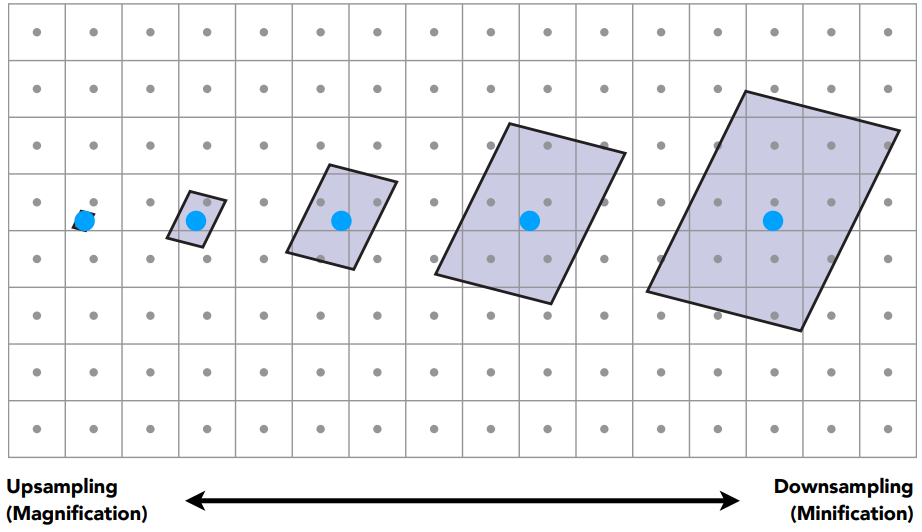

# 计算机图形学（三）：纹理映射

## 纹理管线($The\;Texture\;Pipeline$)

纹理映射 ($Texture Mapping$) 是一种将物体空间坐标点转化为纹理坐标，进而从纹理上获取对应纹素值，以增强着色细节的方法。

纹理管线($The\;Texture\;Pipeline$), 也就是单个纹理应用到纹理贴图的详细过程,其中每一个步骤均可以被用户灵活控制。

一个砖墙的纹理管线处理过程。

假设拥有三维模型空间到二维纹理空间的映射关系,只需要将每个顶点的颜色信息存储在二维纹理贴图上,在进行光照计算时根据**映射关系**查询每个顶点的颜色信息。所有点计算完后，就好像整个纹理被贴到了物体表面一样。但是如何建立这种映射关系呢？接下来介绍两种方式。

## 投影映射-从物体坐标系到参数空间（$Projector\;and\;Mapping$）

### $Projector$
对于简单规则的几何体，通常用投影的方式。

这种将矩形地图纹理均匀贴到球面的投影函数称为：$Spherical$

此外还有Plane，Cubic，Cylindrical：

### $UV\;Mapping$
对于更复杂的物体，往往需要建模师精心制作，将三维顶点与二维纹理坐标一一对应。
在实时渲染中，通常将uv信息保存在顶点中，在三角形光栅化时，通过重心坐标插值的方式计算每个片元的uv坐标。再从纹理中采样获得对应值。把这个颜色信息作为该点的漫反射系数$K_d$。

## $纹理坐标（uv）$
在纹理空间内任意一个二维坐标都在$[0,1]$之内（其实本质上是百分比）。如下图右侧可视化纹理空间空间所示。u对应x轴（r），v对应y轴（g），因此我们看到的纹理空间是偏红绿色的。

## 变换函数-从参数空间到纹理空间（$Corresponder\;Function$）

在上一步中，我们将三维空间坐标映射到了**二维参数空间uv**。在此阶段可以做三件事：坐标范围处理、坐标自由变换、转到纹理空间。

### 坐标范围处理
通常拿到的uv都是在$[0, 1]$范围内的，但也有可能超出了范围。针对超出范围的值，有几种不同的处理方式，拿openGl举例来说，有以下四种方式来处理uv在$[0,1]$范围外的情况：

1. $Repeat$：纹理环绕默认行为，超出范围将重复纹理：$uv = mod(uv,vec2(1.0))$

2. $Mirror$: 和$Repeat$相同，但是每次重复都会做镜像反转：$uv = abs(mod(uv,vec2(1.0)) - 1.0)$

3. $Clamp\;To\;Edge$:将坐标限制在0和1之间。所有超出1的uv将被设置为1.造成边缘图案被拉伸的效果：$uv = clamp(uv,vec2(0.0), vec2(1.0))$
   
4. $Clamp\;To\;Border$:超出$[0,1]$范围uv坐标对应的片元使用用户自定义的颜色填充：$uv = clamp(uv,vec2(0.0), vec2(1.0))$

### 坐标自由变换
除了对这些超出范围的uv值处理，还可以对其施加“变换”，比如旋转，平移，缩放，比如想要让纹理随着时间运动起来，那么就可以逐帧偏移uv值
但要注意的是：对uv坐标施加的变换矩阵，往往是实际想要变换的逆矩阵。
如：若想让纹理向右偏移0.5单位，那么则应该是$u – 0.5$而不是$u + 0.5$。就好比是通过一个窗口去看这张纹理，$uv$就是窗口，窗口向左移动，看起来就是纹理向右移动

### 变换到纹理空间
在对uv进行变换后，其值都落到了$[0, 1]$之间，这时只需要分别乘以纹理的宽高，就可以得到实际的纹理坐标。

## 纹理采样（$Texture\;Sampling$）
屏幕上的每个单元格我们称之为像素($Pixel$),与之相对应，纹理上的一个单元我们称为纹素($Texel$)。理想情况下，我们希望每个像素和每个纹素一一对应。即纹理图片分辨率和物体一致，这样渲染的结果不会失真。只需要每个texel逐个读取即可。但现实情况是，纹理往往会过大或过小。针对这两种不同的情况，需要分别来处理。

### $footprint$
纹理过小，一个小范围内的像素将对应同一个纹素，需要放大（$Magnification$），是一个上采样（$upsampling$）的过程。纹理过大，一个像素覆盖很多个纹素，需要缩小（$Minification$）,是一个下采样($downsampling$)的过程。

### 纹理过小

想象将一张很小的图贴到物体上，如果使用着色点的uv取最近的纹素，物体上一个区域内的着色点将对应纹理上同一个纹素，这必然会造成失真，为此我们需要根据当前着色点uv，取周围最近4个顶点（纹理网格顶点），通过加权平均计算当前着色点的颜色，缓解这种走样现象。
下面介绍双线性插值，实现不同的上采样纹理插值。

（1） 计算$p$点周围四个点的位置，方法是+0.5后保留小数，用范围为$[0, 1]$的$(u^丶，v^丶)$表示
（2） 选取计算权重函数f，有多种函数可选择，计算横向和纵向插值的权重$(w_u,w_v)$
（3）先后对横向和纵向两个方向进行插值（共三次，横向两次，纵向一次）。得到最终纹理值。

### 纹理过大

纹理过大，导致一个pixel覆盖了多个texel,会使生成的图像产生更明显的失真。近处产生锯齿，远处产生摩尔纹。为什么远处会产生摩尔纹呢？这种现象是光栅化的算法导致的。我们知道，一个三角形有顶点坐标和纹理坐标，纹理坐标范围是$[0-1]$。光栅化的过程就是把三角形在屏幕上离散化为像素的过程，插值计算三角形内部每个像素的顶点数据，包括常见的深度值与纹理坐标。如果这个三角形距离camera近,也就是说在屏幕上占了较多的像素，那么相邻两个像素的纹理坐标是接近的，这样通过纹理坐标获得纹理贴图上的纹素值也是接近的，这样这俩个像素看起来比较平滑，视觉上不突兀，同时gpu读取也快速，因为大部分纹素是在cache中读取的。而如果这个三角形距离camera较远，也就是在屏幕上只占了很少的像素，这种情况就是一个小物体应用了一个大纹理，光栅化后，相邻两个像素的纹理坐标差别会很大，读取到的纹素也会差别很大，会很突兀，尤其是camera移动时特别明显，因为很小的移动会造成纹素采样变化很大，产生闪烁现像，除此之外，gpu读取性能也很低效，因为两个相邻的像素所对应的纹素，一个可能在cache中，另一个还没有加载到cache中。

#### $superSampling$
这种现象被形象的称为屏幕像素在texture空间的footprint。一个屏幕空间的蓝色像素点离相机越远，对应在texture空间的范围也就越大。其实就是欠采样的一种表现，一种直观的解决方法就是Supersampling，如果一个像素点不足以代表一个区域的颜色信息，那么便把一个像素细分为更多个小的采样点不就可以解决这个问题了吗？但问题是这种超采样的方式造成很大的性能问题。我们可以换种思路，不做超采样，而是求出每个像素对应footPrint里所有texel的颜色均值，而这种技术正是Mipmapping。

### $Mipmapping$

$Mipmapping$基本思想就是预生成一系列不同尺寸的多级纹理，纹理采样时，计算对应的细节等级，再利用三线性插值($Trilinear interpolation$)计算获取最终纹理值。

level0代表的是原始texture，也是精度最高的纹理，随着等级的提升，每提升一级将4个相邻纹素点求均值合为一个像纹素点，因此越高等级也就代表了越大的footprint区域查询。接下来要做的就是根据屏幕像素的footprint大小选定不同level的texture，再进行点查询即可，而这其实就相当于在原始texture上进行了区域查询。

#### 计算像素点的$footPrint及levelD$
在屏幕空间中取当前像素点的右方和上方的两个相邻像素点(4个全取也可以，**一个像素的大小**)，分别查询得到这3个点对应在Texture space的坐标，计算出当前像素点与右方像素点和上方像素点在Texture space的距离，近似得到footPrint，二者取最大值，计算公式如图中所示，那么level D就是这个距离的log2值 (D = log2L) 。

但是这里计算出的D值是一个带小数的值，而我们事先定义的levelD都是整数，这里可以通过$ceil和floor$函数分别取当前D值的上一层和下一层。分别对这两层纹理做双线性插值，最后在层与层之间再做一次线性插值，插值权重根据D值的小数部分来计算。

#### 三线性插值

## 总结
在通过纹理采样取得颜色值后，并不一定直接将纹理值作为颜色使用，还有很多其他用途，例如$normalMap$中存储顶点法线，$shadowMap$第一个pass存储相机在光照空间下的深度纹理等等，在$bumpMap$中当作高度偏移值等等。

总结纹理映射的几个步骤。

1） 投影映射：将三维物体坐标转化为二维参数空间$uv$坐标，实时渲染中,$uv$坐标通常是保存在顶点信息中。

2） 变换函数：将$uv$坐标经过处理变换后，根据实际的纹理尺寸，转化为纹理空间坐标，此时也可能有小数。

3） 纹理采样：依据纹理空间坐标，对纹理进行采样，要处理放大和缩小两个情况，其中缩小的情况更为复杂，牵涉到各向异性过滤的算法。

4） 纹理转换：通过采样得到纹理值后，往往不能直接使用，还需要进行相应转换才能使用。

## 参考
[GAMES101 -现代计算机图形学入门-闫令琪](https://www.bilibili.com/video/BV1X7411F744?p=15&vd_source=b3b87210888ec87be647603921054a36)

[纹理映射流程](https://zhuanlan.zhihu.com/p/369977849)

[Real-Time Rendering 3rd》提炼总结](https://github.com/QianMo/Real-Time-Rendering-3rd-CN-Summary-Ebook)

