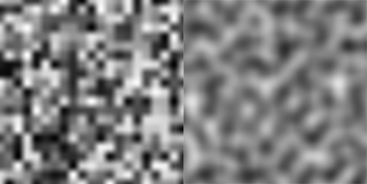
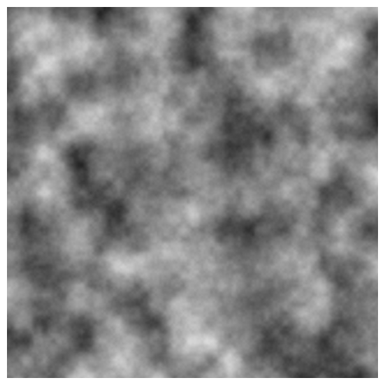
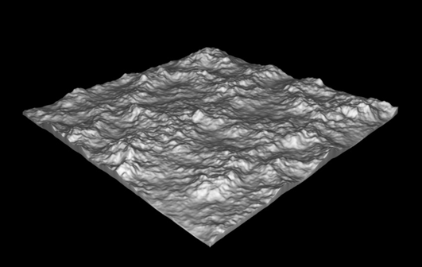
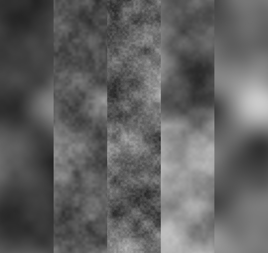
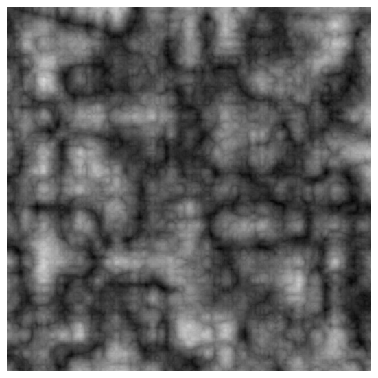
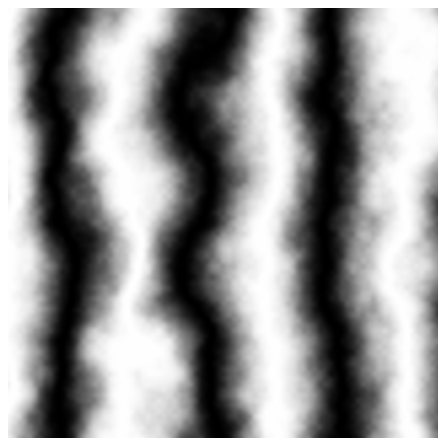
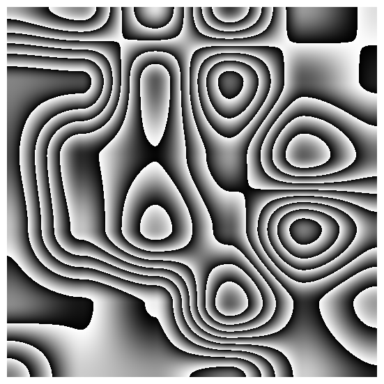

# 计算机图形学（九）：噪声-下

## $2D\;Noise$

在上一章中，我们介绍并解释了实现一维噪声函数的大部分技术和方法。创建更高维度的噪声和一维噪声并没有本质上的区别，因为它们都是基于同样的方法和技术。之前提到过，所有的噪声函数都会返回一个浮点数，无论输入参数是浮点数，二维点还是三维点，至于一维噪声 二维或三维噪声仅与其输入值有关。二维噪声是将二维点作为输入参数的噪声函数。
对于二维噪声，我们会在网格顶点处分布随机值。噪声函数的2D版本以2D点作为输入，假设当前要求的点为$p$。与一维版本类似，我们先得找到点$p$在网格中的位置，如果点在网格之外，可以通过相同的取模技巧重新映射$p$点的位置，得到网格上点$p$的新坐标，记作$Pnoise$。
之前的章节中讲过插值相关的很多内容。


如下图所示：点$Pnoise$被一个单元上的四个顶点所包围。使用之前学到过的双线性插值技术可以轻松得到点$Pnoise$的值（周围四个点的加权平均）：


为此我们首先计算$s和t$，它们是一维噪声中t的对应物：


代码实现如下：

```typescript
    function lerp(min:number, max: nmber, t: number) {
        return min * (1-t) + max * t;
    }

    function smoothStep(t: number) {
        return t * t * (3- 2 * t);
    }

    class vec2 {
        public x: number;
        public y: number;
        constructor(x: number,y: number) {
            this.x = x;
            this.y = y;
        }
    }

    class ValueNoise {
        public K_MAX_TABLE_SIZE: number;
        public K_MAX_TABLE_SIZE_MASK: number;
        public vertices: number[];
        constructor(){
            this.K_MAX_TABLE_SIZE = 256;
            this.K_MAX_TABLE_SIZE_MASK = this.K_MAX_TABLE_SIZE - 1;
            this.vertices = [];
            for (let i = 0; i < this.K_MAX_TABLE_SIZE * this.K_MAX_TABLE_SIZE; i++) {
               this.vertices[i] = Math.random();
            }
        }

        computeX(p: vec2) {
            const xi = Math.floor(p.x);
            const yi = Math.floor(p.y);
            const s = p.x - xi;
            const t = p.y - yi;

            const rx0 = xi & this.K_MAX_TABLE_SIZE_MASK;
            const rx1 = (rx0 + 1) & this.K_MAX_TABLE_SIZE_MASK;
            const ry0 = yi & this.K_MAX_TABLE_SIZE_MASK;
            const ry1 = (ry0 + 1) & this.K_MAX_TABLE_SIZE_MASK;

            //通过置换表查找四个顶点处的随机值
            const c00 = this.vertices[ry0 * this.K_MAX_TABLE_SIZE_MASK + rx0];
            const c10 = this.vertices[ry0 * this.K_MAX_TABLE_SIZE_MASK + rx1];
            const c01 = this.vertices[ry1 * this.K_MAX_TABLE_SIZE_MASK + rx0];
            const c11 = this.vertices[ry1 * this.K_MAX_TABLE_SIZE_MASK + rx1];

            //对得到的s和t做平滑处理
            const ss = smoothStep(s);
            const st = smoothStep(t);

            const a = lerp(c00, c10, ss);
            const b = lerp(c01, c11, ss);

            return lerp(a, b, st);
        }
    }
```

## 简单的模式示例
本小节将介绍使用噪声函数创建的模式示例。当$Ken\;Perlin$最初发明他的噪声函数时，他还提出了一些简单的算法来使用这个函数作为构建模块来生成有趣的纹理。其中一些例如流噪声（$turbulence $），现在仍然被广泛使用。他在1985年的Siggraph上描述了这些模式中的大部分。



之前我们实现的基础版噪声看起来有很多的“块状”,如上图所示，左侧是基于当前版本噪声函数生成的纹理，右侧是$Perlin\;Noise$生成的。本章不会讲解$Perlin\;Noise$，而是了解该技术的工作原理和函数特性。基于目前说了解到的噪声函数特性，实现一些略微复杂的纹理效果。

### $1D\;Noise$示例
首先介绍的一种技术叫做分形叠加（$Fractal\;Sum$），其背后思想是叠加几种频率和振幅不同的噪声，每一个噪声称为一个$Layer$，层与层之间的频率和振幅不一样，却是有关联的。
如下图所示，第一条噪声曲线是原始噪声函数生成的（频率和振幅均为1），其他各层的频率为上一层的两倍，振幅为1/2，通过这种方式创造一系列的噪声并将它们叠加起来会得到下图底部的函数图像：


可以看到，这条曲线比单条噪声函数有更丰富的局部细节，这也正是分形叠加所要达到的目的，通过高频低振幅的噪声填充原始曲线的局部细节。将分形叠加推广到二维，生成的二维纹理应用于平面的纹理贴图（displaceMapping），可以生成类似于地形的东西。
代码实现：

```typescript
    const amplitude = 1;
    const frequency = 1;
    //通常被设置为 3，5 或者 7
    const layers = 5;
    let noiseSum = 0;
    for (let i = 0; i < layers; i++) {
       noiseSum += noise(p * frequency) * amplitude;
       amplitude *= 0.5;
       frequency *= 2;
    }
```

### 术语
- 分形叠加（$fractal\;Sum$）:将频率和幅度相互关联的噪声层相叠加的技术可以称为分形叠加。
- 粉红噪声（$Pink\;Noise$）:分型噪声的连续层具有与其频率成反比的振幅。
- 布朗噪声（$Brownian\;noise$）:当我们将层之间的频率加倍并且这些层的幅度与其频率成反比时，我们会获得一种特殊类型的粉红噪声，我们称之为布朗噪声（以数学家罗伯特布朗命名）。

```typescript
    let pinkNoise = 0;
    const layers = 5;
    const rateOfChange = 2;
    for (let i = 0; i < layers; i++) {
        pinkNoise += noise(p * Math.pow(rateOfChange, i)) / Math.pow(rateOfChange, i);
    }
```
- 频谱密度（$spectral densities$）:连续层之间的频率和振幅的变化几乎形成了噪声曲线的特征。 它定义了它的光谱特性。 我们使用术语频谱密度来定义产生噪声的各种频率（层）。
- 功率谱（$power spectra$）:这些层中的每一层都有一个特定的振幅，我们称之为功率谱

- 间隙度（$lacunarity$）:控制层与层之间频率的变化率
- $gain$: 控制层与层之间振幅的变化率

### $2D\;Noise$示例
#### 分形叠加（$Fractal\;Sum$）
在1D示例中已经介绍额分形叠加的技术原理，在此我们将实现其二维版本：


```typescript
    const layers = 5;
    const imageWidth = 256;
    const imageHeight = 256;
    let maxNoiseVal = 0;
    let frequency = 1;
    let amplitude = 1;
    let noiseMap = [];

    for (let i = 0; i < imageHeight; i++) {
        for (let j = 0; j < imageWidth; j++) {
            vec2 pNoise = vec2(i, j);
            frequency = 1;
            amplitude = 1;
            for (let k = 0; k < layers; k++) {
                noiseMap[i * imageWidth + j] += noise.commputeX(pNoise * frequency) * amplitude;
                frequency *= 2;
                amplitude *= 0.5;
            }
            if (noiseMap[i * imageWidth + j] > maxNoiseVal) {
                maxNoiseVal = noiseMap[i * imageWidth + j];
            }
        }
    }
```
基于以上程序生成的纹理如下图所示:



注：因为我们将几层噪声相加，结果可能大于1，因此当我们将值转换为颜色时，将出现问题。解决此问题的其中一个思路是使用clamp函数，将值限制到$[0,1]$之间。但更好的方案是将遍历NoiseMap，每次循环将噪声值除以最大值（存储于maxNoiseVal中）来标准化噪声值数组。


之前提到过，分形叠加可以生成许多自然中的纹理，例如起伏的地形：



各种各样的纹理图案都是通过改变分形噪声函数的间隙度（$lacunarity $）和$gain$来控制的：



#### 流噪声（$Turbulence$）
**与分形噪声的原理相同，但是流噪声使用的是噪声结果的绝对值**。而不是直接使用每一层噪声函数。我们会先将噪声结果转换为有符号噪声，然后取其绝对值。如下图所示，以这种方式处理噪声函数会生成一个由凹凸组成的轮廓。这种技术可以产生模拟火，烟或云的图案。



代码示例如下：

```typescript
    const frequency = 0.02;
    const lacunarity = 1.8;
    const gain = 0.35;
    const layers = 5;
    const maxNoiseVal = 0;
    const imageHeight = 256;
    const imageWidth = 256;
    const noiseMap = [];
    for (let i = 0; i < imageHeight; i++) {
        for (let j = 0; j < imageWidth; j++) {
           vec2 pNoise = vec2(j, i);
           amplitude = 1;
           frequency = 0.02;
           for (let k = 0; k < layers; k++) {
                noiseMap[i * imageWidth + j] = noise.computeX(pNoise * frequency) * amplitude;
                frequency *= lacunarity;
                amplitude *= gain;
           }
           if(noiseMap[i * imageWidth + j] > maxNoiseVal){
                maxNoiseVal = noiseMap[j * imageWidth + j];
           }
        }
    }

    for (let i = 0; i < imageWidth * imageHeight; i++) {
       noiseMap[i] /= maxNoiseVal;
    }
```


#### 大理石纹理（$Marble\;Texture$）
大理石纹理可以通过噪声函数或分形和调制正弦的相位来创建，关键点在于不直接使用噪声函数创建纹理，而是扰乱创建纹理的函数。这个想法可以用任何周期性函数中引入随机性。


示例代码如下：
```typescript
    const frequency = 0.02;
    const lacunarity = 1.8;
    const gain = 0.35;
    const layers = 5;
    const maxNoiseVal = 0;
    const imageHeight = 256;
    const imageWidth = 256;
    const noiseMap = [];
    let noiseVal = 0;
    for (let i = 0; i < imageHeight; i++) {
        for (let j = 0; j < imageWidth; j++) {
           vec2 pNoise = vec2(j, i);
           amplitude = 1;
           frequency = 0.02;
           noiseVal = 0;
           for (let k = 0; k < layers; k++) {
                noiseVal = noise.computeX(pNoise * frequency) * amplitude;
                frequency *= lacunarity;
                amplitude *= gain;
           }
           if(noiseVal > maxNoiseVal){
                maxNoiseVal = noiseVal;
           }
           noiseMap[j * imageWidth + i] = (sin((i + noiseValue * 100) * 2 * Math.PI / 200) + 1) / 2; 
        }
    }

    for (let i = 0; i < imageWidth * imageHeight; i++) {
       noiseMap[i] /= maxNoiseVal;
    }
```

#### 木纹（$Wood\;Texture$）
与大理石纹理一样，木质纹理依赖于一个很简单的技巧。基本思想是将噪声函数乘以大于1的某个值。让我们将这个乘法结果称为$g$,纹理是通过从其整数部分减去$g$获得的。因此减法结果必然在$[0,1)$之间。



```typescript
    const g = noise.computeX(vec2(i, j) * frequency) * 10;
    noiseMap[i * imageWidth + j] = g - Math.floor(g);
```
## 参考

[Scratchapixel](https://www.scratchapixel.com/)