# 计算机图形学（二）：着色
渲染过程本质可以上分解为两个步骤:可见性测试和着色。光栅化和光线追踪本质上都是用于解决可见性问题。本章我们将介绍渲染过程的第二部分:着色。着色是一个庞大的主题。一些用于着色的技术在数学上也很复杂。本章我们将学习最基本的着色模型: $Blinn-Phong\;Reflectance\;Model$

## $blinn-Phong\;Reflectance\;Model$
当我们观察一个物体时，可以明显的将物体的视觉表现分为三类：
- 高光：表现很亮的部分，并且会随着视角的变化而变化
- 漫反射部分：颜色变化不明显，表示物体本身的颜色或者diffuse颜色。（物体表面吸收了部分光线，反射出的未被吸收的部分）
- 环境光：未被光照直接照亮的部分，**模拟间接光照**。在布林冯模型中简化为常量。这也是为什么布林冯模型被称为经验模型的原因。计算精确的间接光照需要$RayTracing$。

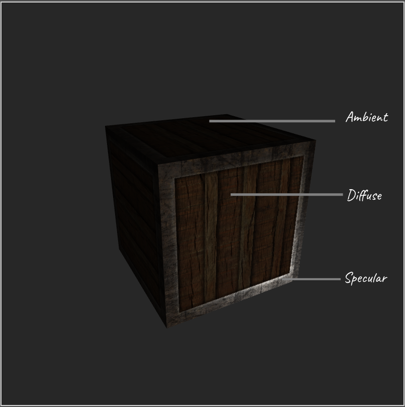

布林冯光照模型是一个经验模型。整体思想就是按照这三部分来建模的。布林冯光照模型是一个直接光照模型（或者叫局部光照/局部性），不考虑间接光照，即不考虑周围物体反射的光线对其产生的影响。着色权重仅考虑光源。（阴影及SSAO需要多个pass处理）

### 定义光照参数

要计算物体表面着色点光照结果，需要定义一些基本的参数。

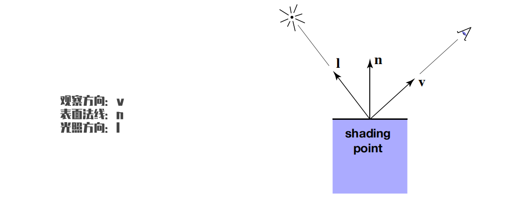

- 观测方向（$view direction$）$\hat{v}$:着色点到观测点（相机）的单位向量
- 光照方向（$light direction$）$\hat{l}$：着色点到光源的单位向量
- 着色点法线（$normal$）$\hat{n}$：垂直于表面的向量，用于描述表面（或着色点）的方向。
- 物体表面本身着色参数（漫反射颜色 高光颜色 粗糙度...）

### 漫反射（$Diffuse\;Reflection$）
当一根光线打到物体表面后，光线会被均匀的反射到不同的方向（其实这也是一种近似）。
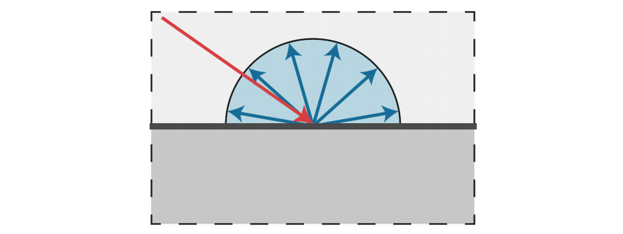

#### $Lambert's\;cosine\;law$
当一束光到达物体表面时，表面朝向（法线方向）与光照方向的角度不同，得到的明暗也是不一样的，着色点法线与光线夹角越大，表面实际接收到的光线越少，**物体表面接收到的光照能量与着色点法线和光照夹角余弦成正比。**由于法线和光照方向均为单位向量。因此表面着色点接收到的能量正比于$\hat{n}\cdot\hat{l}$

#### $Lambert\;Shading$
我们知道球体表面积公式:$A = 4\pi{r^2}$对于点光源来说，假设点光源辐射的能量是均匀的。那么随着着色点和光源距离的增加，着色点接收到的能量就越少（距离增加导致球体表面积增大，而单位时间单位立体角点光源辐射的能量是一样的，因此单位面积接收到的能量会衰减）。着色点接收到的能量与距离平方成反比。

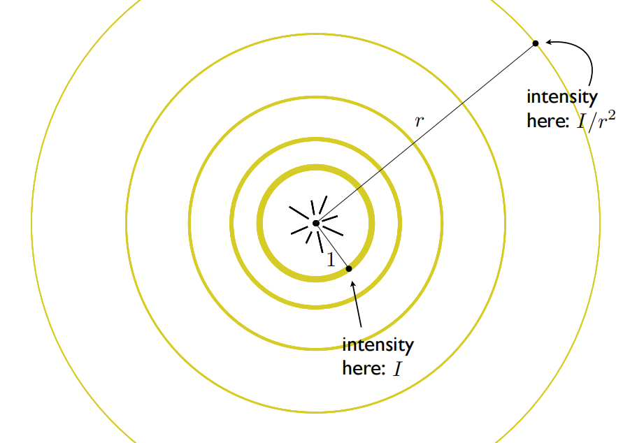

漫反射分量：
$L_d = K_d\dfrac{I}{r^2}max(0, \hat{n}\cdot\hat{l})$

- Kd（漫反射系数）：光到达物体表面后，能量会被吸收一部分（不同材质的物体对不同波长的光线吸收率是不一样的），剩下的会被反射出来，漫反射系数即定义了不被物体所吸收的光照颜色（$diffuseColor$），即物体表现出的颜色。
- $\dfrac{I}{r^2}$：光照能量衰减系数，抵达物体表面的能量与光源和着色点距离平方成反比。
- $max(0,\hat{n}\cdot\hat{l})$:  $Lambert's\;cosine\;law$，表面着色点接收到的能量正比于$\hat{n}\cdot\hat{l}$。为了避免负值情况使用max做了最小值约束。

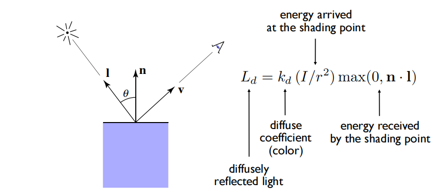

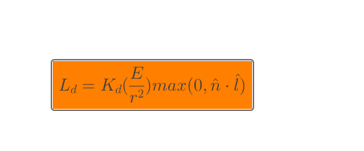

$K_d$系数对漫反射表现得影响：

随着$K_d$的增加（吸收光线减少，反射光线增加），物体表现越来越明亮。

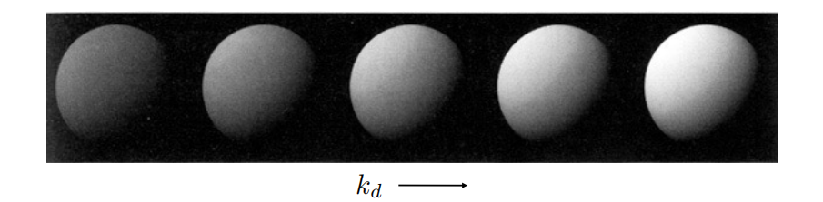

### 高光（$Specular\;Reflection$）

让我们从反射开始，反射是光与物质相互作用的一种形式。反射是光子或入射光束撞击到反射表面的结果，例如玻璃，光滑的金属，镜子都容易形成高光反射。反弹的方向与撞击点表面法线方向对称，也就是说，如果入射方向与表面法线的夹角记为$\theta_i$，反射方向与表面法线的夹角为$\theta_r$，则$\theta_i = \theta_r$。即反射定律。因此当观测方向与光线反射方向接近时，高光表现强烈，反之高光表现减弱，高光项与反射向量和观测向量的点积成正比。因此高光是与观测方向紧密相关的。

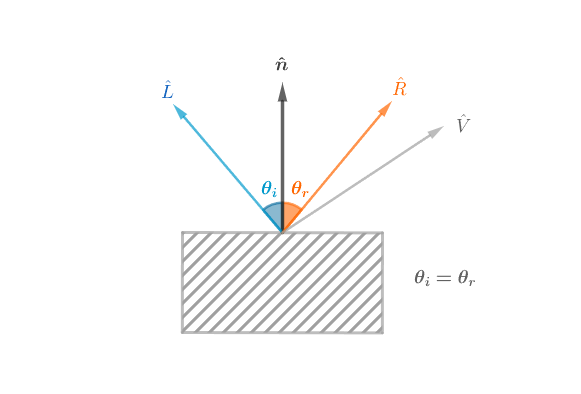

#### 计算反射向量
接下来需要计算反射向量，然后计算反射向量和观测向量点积，即可得到从当前视角观测着色点的高光分量。那么如何计算反射向量呢？可以先计算$\hat{L}$在$\hat{n}$上的投影向量$\vec{B}$（向量点积即可），然后根据向量加法计算$\vec{A}$向量。如下：

$\vec{B} = \cos\theta_i||\vec{L}||\hat{n} = (\hat{L}\cdot\hat{n})\hat{n}\\ \dfrac{\vec{A}}{2} = \vec{B}-\hat{L} = (\hat{L}\cdot\hat{n})\hat{n} - \vec{L}\\
\vec{R} = \vec{B} + \dfrac{\vec{A}}{2} = (\hat{L}\cdot\hat{n})\hat{n} + (\hat{L}\cdot\hat{n})\hat{n} - \vec{L} =2(\hat{L}\cdot\hat{n})\hat{n} - \hat{L}$

#### 半程向量（$half\;vector$）
但是以上计算反射向量来计算高光系数的方式过于繁琐，有一种更简便的办法，通过**半程向量**（光照方向和观测方向的角平分线方向，利用向量平行四边形法则求和然后归一化处理即可）。半程向量与法线方向越接近，则观测方向与反射方向就越接近。因此可以计算半程向量和法线的点积来代替反射方向与观测方向的点积，因为半程向量好计算（只需要加法操作），节省了一次向量点积带来的运算开销。

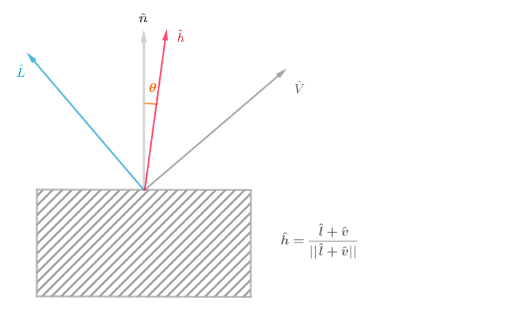

$\hat{h} = \textbf{bisector(\textbf{v}, \textbf{l})} = \dfrac{\hat{l} + \hat{v}}{||\hat{l}|| + ||\hat{v}||}$
#### 高光计算公式

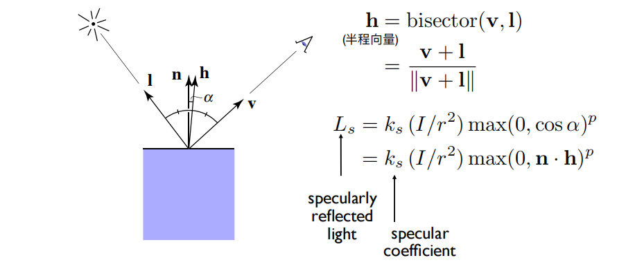

- $K_s$（镜面反射系数）:系数越大，亮度越大。同时因为高光通常是白色，所以表示颜色通常也为白色。
- $\dfrac{I}{r^2}$: 布林冯为经验模型，用抵达着色点的能量近似代替被着色点接收的能量，因此此处并没有像漫反射一样计算夹角余弦。
- $bisector$: 布林冯模型对冯模型的改进，用半程向量代替反射向量，减少了一次点积计算。
- $指数P$:该指数用于加快函数的衰减程度，由于在物理世界中高光存在于物体表面很小的一部分，而余弦的衰减速度太慢，通过携带指数，可以促进衰减速度，使得高光只能在与法线向量非常接近的情况下才能被视角看见.

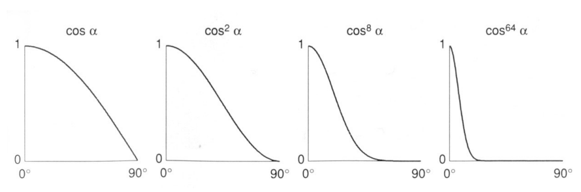

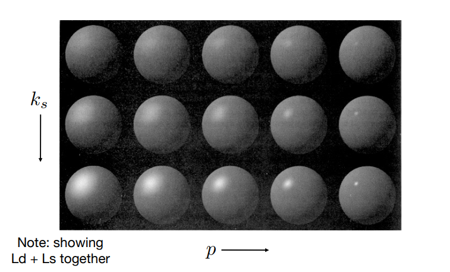

### 环境光（$Ambient$）
在 Blinn-Phong 模型中，提出了一个非常大胆的假设：物体表面接收到的各种环境光都是相同强度的。当然，这并不符合常理，但是大大简化了计算环境光的步骤，强度相同，意味着反射光的强度也相同，而由于环境光来自四面八方的物体反射，所以该物体表面反射环境光的方向也是四面八方的，那么：环境光与光源的角度无关，与观察角度也无关，所以它是一个常数。

计算环境光的公式非常简单，只需要得到物体表面的环境光吸收率和环境光的强度即可：

$L_a = K_a{I_a}$

### 总结$blinn-Phong\;Reflectance\;Model$

最后，将漫反射、高光和环境光作用在物体表面上的效果叠加在一起，就可以得到近似于物理光照的效果。

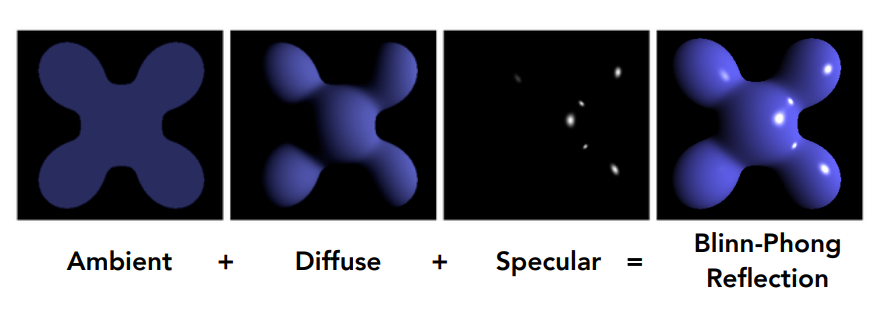

$L = L_a+L_d+L_s = K_aI_a + K_d\dfrac{I}{r^2}max(0, \hat{n}\cdot\hat{l}) + K_s\dfrac{I}{r^2}max(0, \hat{n}\cdot\hat{h})^p$

## 参考
[GAMES101 -现代计算机图形学入门-闫令琪](https://www.bilibili.com/video/BV1X7411F744?p=7&vd_source=b3b87210888ec87be647603921054a36)