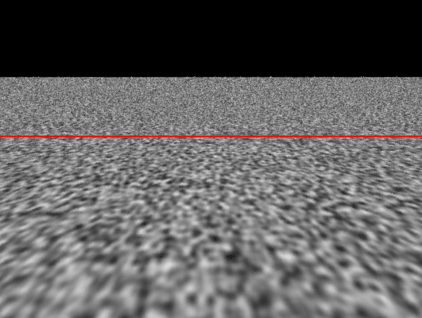

# 计算机图形学（八）：噪声-上
本章将介绍噪声的基础内容，包括噪声是什么，它的属性以及可以用来做什么。噪声不是一个难以理解的复杂概念，但它有许多微妙之处需要注意。 正确使用它需要了解它的工作原理和实现方式。 为了创建一些图像并使用各种参数进行实验，我们将实现一个简单（但功能齐全）的噪声函数，称为$Value Noise$。 本章我们将忽略许多过于复杂而无法在此处全面研究的技术，只是对噪声及其一些应用的初步介绍。 

## 历史背景
噪声是在80年代中期发明的，起初是作为图像纹理的替代方法。主要原因在于80年代中期的电脑内存有限，无法容纳用于纹理映射的图片，于是人们开始寻找替代解决方案。用纯色渲染物体看起来太无趣了，需要通过调整物体的表面材质属性来打破这种干净的外观。在编程中，我们通常在需要创建随机时使用伪随机数生成器。然而使用$RNG(Random\;number\;generator)$是远远不够的。我们在自然界中观察到的随机模式通常是很自然的，物体表面上距离很近的两个点通常看起来会比较相似。但是同一物体上相距很远的两个点却差异很大。换句话说：**局部变化是细微的，是渐进的，而全局变化则是很大的。**$RNG$无法满足这个要求，因为每次调用随机数生成器它会返回和其它数值完全不相干的随机数。因此调用这个函数会产生两个完全不同的数字，最终产生杂乱无章的白噪声。下面是一个例子：让我们观察一块真实岩石的图像，假设我们想要复现该CG图像。这个例子很有趣，因为我们可以看到岩石图案由三种颜色组成：绿色，粉色和灰色。这些颜色或多或少分布在岩石表面上。我们首先使用随机数生成器的版本：

```c++
void GenerateRandPattern() 
{ 
    unsigned imageWidth, imageHeight; 
    imageWidth = imageHeight = 512; 
    static const unsigned kNumColors = 3; 
    Color3f rockColors[ kNumColors ] = { 
        { 0.4078, 0.4078, 0.3764 }, 
        { 0.7606, 0.6274, 0.6313 }, 
        { 0.8980, 0.9372, 0.9725 } }; 
    std::ofstream ofs( "./rockpattern.ppm" ); 
    ofs << "P6\n" << imageWidth << " " << imageHeight << "\n255\n"; 
    for ( int j = 0; j < imageWidth; ++j ) 
    { 
        for ( int i = 0; i < imageHeight; ++i ) 
        { 
            unsigned colorIndex = std::min( unsigned( drand48 () * kNumColors ), kNumColors - 1 ); 
            ofs << uchar( rockColors[ colorIndex ][ 0 ] * 255 ) << 
                   uchar( rockColors[ colorIndex ][ 1 ] * 255 ) << 
                   uchar( rockColors[ colorIndex ][ 2 ] * 255 ); 
        } 
    } 
    ofs.close(); 
} 
```


上图中间的图像是程序生成的，结果并不理想，实际上这个模式有个名字，白噪声（$white\;Noise$）（稍后会解释什么是白噪声）。使用$RNG$为程序生成纹理的每个像素随机选择一种颜色，使得结果中每个像素的颜色变化很大。为了改进结果，我们复制了纹理的一小块区域（10x10像素），将其调整到原始图像的尺寸（256x256），进行高斯模糊处理，生成的图像如上右所示，局部有了较小的变化，而全局变化比较明显。

这个实验结论告诉我们，为了创建平滑的随机图案，需要在网格的固定位置上使用$RNG$分配随机数，然后使用高斯模糊来模糊这些值。下章将详细介绍如何对随机数做模糊，现在只需要记住：**噪声（在图形学上下文中）是一个用于模糊在网格上生成的随机数的函数。**

目前应用最广泛的噪声版本是由$Ken\;Perlin$在1983年实现的，称为柏林噪声（$Perlin\;Noise$）当时他正在制作1982年版本的电影 Tron（© Walt Disney Pictures）。肯·柏林 (Ken Perlin) 于1997年获得美国电影艺术与科学学院颁发的奥斯卡技术成就奖，以表彰他对这部电影的贡献。 他于1984年在Siggraph展示了他的工作，并于1985年发表了一篇论文《An Image Synthesiser》，这是程序化纹理开创性的成果。Perlin噪声会在后续章节中进行解释。


## 程序化纹理的世界
噪声的发展引领了计算机图形学研究的一个全新领域，噪声可以被视为一个基本的构件模块，从中可以生成许多有趣的程序化纹理。在程序化纹理的世界中，可以生成许多类型的纹理，它们不一定都是模仿自然中的图案，可以是规则的，不规则的或随机的。
除了规则图案,所有其它的图案都可以使用噪声来生成纹理,自从$Ken\;Perlin$发明了他的噪声函数以来,工业界开始逐渐使用它来生成复杂的材质纹理,例如 地形, 云 水体模拟等.噪声不仅可以通过生成纹理改变物体表面着色,也可以用于程序化建模,替换物体表面结构(地形),控制体积密度(体积渲染).通过每帧偏移噪声输入值,我们也可以将它应用于程序化动画.直到90年代中期,它是最受欢迎的水体模拟动画方法.

## 优势和劣势
在本章开始我们就提到,噪声不同于纹理,相较于纹理贴图不会占用很大的内存,同时噪声函数的实现也并不复杂.最后,使用噪声为对象添加纹理不需要表面的任何参数化数据,但这通常是纹理映射所必须的($uv$)。

但是，噪声函数生成通常比纹理映射要慢。噪声函数需要执行一些相对复杂的数学运算，而纹理映射仅读取纹理图片的每个纹素数据即可。

## 噪声的属性
**噪声是伪随机的**。这可能是它最重要的一个属性。它看起来像是随机的，可实际上确实有迹可循的。输入相同的参数，噪声函数总会返回同样的数值。

**噪声函数总是返回一个浮点数，无论输入数据的维度是多少**。输入数据的维度通过噪声函数的名字来表达，1D 2D 3D噪声函数分别表示函数的入参是一个数值，二维的点，三维的点。另外还有4D噪声，它的输入参数有两个，一个三维点和一个额外的浮点值，用于随着时间的推移对噪声进行动画处理。从数学上讲噪声函数实际上是一个从$\mathbb{R}^n$到$\mathbb{R}$的映射。它以n维点作为输入返回一个浮点数。1D噪声通常用于物体动画，2D和3D噪声用于生成物体表面纹理，另外3D噪声对于体渲染很有用。

**噪声是有限带宽$band\;limited$的**。噪声是一个函数，可以将其视为一种信号（如果绘制噪声的函数图像，将得到一条曲线，即**信号**），在信号处理中，可以将信号从时域空间转换到频域空间，通过频域分析，能够直观的看到构成信号的不同频率。噪声函数可能由多个频率组成（低频表现为宏观变化，高频表现为微观局部的变化）。这些频率中的其中一个会起到主导作用，这一频率定义了噪声函数的整体视觉效果和特征。为什么我们要关心噪声函数的频率？因为当生成的噪声纹理在离相机很远的地方是，会表现为**白噪声**，俗称混叠或走样（$aliasing$）。



之前我们提到过噪声函数使用插值函数或其它平滑函数（高斯模糊等）来模糊各点处生成的随机数，这些平滑函数必须具备两个属性：**连续和可导**。在某些情况下需要计算噪声函数的导数，所以最好选择一个即连续又可导的平滑函数。

最后，当观察一幅由噪声函数生成的图像时，理想情况下不应该能看到噪声模式的重复，换句话说，没有明显边界（接缝处很自然无痕迹），一开始提到，噪声只能在预先定义的尺寸上生成。如果需要计算的噪声超过了噪声函数预定义尺寸的大小该怎么做呢？我们可以把预定义尺寸的噪声比作瓷砖，要使用特定大小的瓷砖覆盖更大的区域时，需要将许多瓷砖彼此相邻平铺。但是这种方法有一些问题。在瓷砖边界处，噪声可能是不连续的。但是我们想要的是从瓷砖到瓷砖的自然过渡，不会看到接缝的存在。

## 一维噪声函数
噪声是一个函数，返回一个介于0到1之间的浮点数。输入参数可能是一维的二维的或者三维四维。本小姐将主要介绍一维入参的情况。可以使用一个伪随机数生成器生成这些浮点数，但每次调用噪声函数会生成完全不可预测的数值，这不是我们想要的，完全基于$RNG$的噪声函数通常被称为白噪声（$White\;Noise$）。这种方法生成的数据不适合作为程序化纹理，因为自然界中的噪声纹理通常都是自然的。


首先要做的是以固定间隔创建一个网格。在二维空间中，将在网格中的顶点处生成这些随机值，在一维中这个网格可以被视为一个标尺，为了简单起见,假设网格的顶点或标尺的刻度沿着x和y轴创建。


创建$2D\;Noise$需要将随机数分配给网格的每个顶点处。对于$1D\;Noise$，随机数将会被分配到x轴固定的间隔处。无论1D还是2D，顶点坐标均为整数，在本示例中，我们仅对前10个数执行此操作，从0到9。

先拿$1D\;Noise$举例说明，在标尺上的整数位置处生成一系列的随机值。例如：当x = 0结果为0.36， x=1结果为0.68，但是当x不是整数时，函数的结果是什么呢？
要计算x轴上任意点的值，需要做的就是找出x轴上该输入值临近的两个整数值（$floor$和$ceil$）。为了计算这个数字，通过线性插值即可（$Linear\;interpolation$）：

$a(1-t) +bt\;\;\;with\; 0 <=t\;<=\;1$

```typescript
    //求出当前位置临近的最小值和最大值
    const currentX = 1.27;
    const min = Math.floor(currentX);
    const max = Math.ceil(currentX);
    //拿到最小值和最大值位置的值
    const a = getValueByX(min);
    const b = getValueByX(max);
    //求出当前时间t
    const t = currentX - min;
    //线性插值计算当前位置的值。
    return a*(1-t) + b*t;
```

使用线性插值计算$[0,1]$范围内任意x值类似于画了一条直线（**线性**）,如果对其它区间的任意x值执行相同的操作，我们会得到如下图所示的曲线。通过这种线性插值技术产生的噪声我们称之为$Value\;Noise$;


我们只在x轴上从x = 0 开始的每个整数位置定义了10个随机值，因此我们只能为$[0,10]$范围内的任何x计算一个值。 为什么[0:10]而不是[0:9]？ 当x在[9:10]范围内时，我们将使用索引9和索引0处的随机值来计算噪声值。如果这样做，曲线的起点和终点是相同的。 换句话说，当x = 0 和x = 10 时的噪声是相同的。让我们复制曲线并将其移动到现有曲线的左侧或右侧。 现有曲线（曲线 1）在 [0:10] 范围内定义，新副本（曲线 2）在 [10:20] 范围内定义。


我们发现在曲线重复连接处没有不连续的情况。因为在曲线1和曲线2是首尾相连的。因此可以根据需要制作任意数量的副本，将噪声函数扩展到无限大。x的值不再限制在$[0,9]$之间。

接下来就是代码实现部分，我们已经知道如何计算$[0,9]$范围内的噪声，但是当x大于9时，例如x = 9.35，我们希望计算在$[9,0]$之间的插值函数。按照常规做法计算x的临近最小最大值，我们得到9和10。我们想要使用0而不是10，这里可以使用取模运算符来实现。使用这种技术，我们可以在沿x轴移动时重复循环遍历噪声函数（类似于复制原始曲线）。**实现了噪声函数的周期性和连续性。**
代码实现如下：

```typescript
class ValueNoise1D<T> {
    public MAX_VERTICES = 10;
    public vertices: T[] = [];
    constructor() {
        for (let i = 0; i < this.MAX_VERTICES; i++) {
            this.vertices[i] = Math.random();
        }
    }

    compute(x: number):T {
        const xFloor = Math.floor(x);
        const xMin = xFloor  % this.MAX_VERTICES;
        const t = x - xFloor;
        const xMax = (xMin === this.MAX_VERTICES -1)? 0 : xMin + 1;

        return this.lerp(xMin, xMax, t);
    }

    lerp<T>(min:T, max: T, t: number):T {
        return min*(1-t) + max*t;
    }
}
```
### 平滑插值
当前版本的噪声函数还存在另外一个问题，锯齿状的函数曲线看起来不够平滑。如果观察自然界中的随机图案，例如水面波纹，海洋波浪的轮廓，它们通常没有这种锯齿感，它们的轮廓通常是自然平滑的。现在让我们改进当前版本的噪声函数，在做插值之前，先通过平滑函数（函数图像表现为“S”形，常用的有$cosine和smoothstep$），针对$t$值做映射（$remap$）。**重要的是要理解插值函数不会改变，我们所作的改变只是在插值前对t值重新映射。**
伪代码如下：

 ```typescript
function smoothNoise(a: number, b: number, t: number) {
    const remapt = smoothFunc(t);
    return lerp(a, b, t);
}
 ```

#### $Cosine$
取$\cos$函数在$[0,\pi]$的部分用于t值的remap，对应的输出是$[1,-1]$，但是现在有两个问题需要解决：
1. 因为t的取值范围是$[0,1]$，在用$\cos$函数remap之前，需要先乘以$\pi$
2. 输出为$[1,-1]$，我们所期望的输出为$[0,1]$，需要对输出结果做重新映射：$\dfrac{1-\cos{(t*\pi)}}{2}$


    使用cos函数对t值做重映射后的噪声函数图像

```typescript
function cosineRemap(a: number, b: number, t: number) {
    const tRemapCosine = (1- Math.cos(t * Math.PI)) * 0.5;
    return lerp(a, b, tRemapCosine);
}
```

#### $smoothStep$
$smoothStep$函数常用于噪声函数的实现，关于$smoothStep$函数的实现原理在之前的文章中有过推导，这里不再赘述。唯一需要注意就是将$smoothStep$函数转换为代码时，由于需要计算t的2和3的幂，可以通过以下代码稍微优化操作：

```typescript
    function smoothStep(min: number, max: number, t: number) {
        const rRemapSmoothStep = t * t * (3 - 2 * t);
        return lerp(min, max, rRemapSmoothStep);
    }
```


    使用smoothStep函数对t做重映射后的噪声函数图像

### 完善一维噪声函数
在本小节中，我们将快速展示改变噪声函数形状的不同方法。在原始噪声函数版本中，使用10个随机数生成噪声，之后它将以10为周期循环重复。在实际应用中，如此小的周期往往无法满足实际需求，噪声函数往往需要处理更大的周期，另外代码必须处理x为负值的情况。

#### 缩放
通过对输入值x或者输出结果应用缩放因子，可以很容易的改变函数图像的形状。对输入值$x$应用缩放因子将改变函数频率。将$x$乘以大于1的值将增加函数的周期性（增大噪声频率），简而言之，压缩函数曲线，周期变短。 如果x乘以小于1的值，将会沿着x轴拉伸曲线，延长噪声函数周期（降低频率）。


    对输入值x乘以缩放因子，来提高或降低噪声函数频率

```typescript
const frequency = 0.5;
const freqNoise = valueNoise1D.compute(x * frequency);
```

第二种情况将函数结果乘以缩放因子，会改变函数图像的振幅（$amplitude$）。


```typescript
const amplitude = 0.5;
const amplitudenoise = valueNoise1D.compute(x) * amplitude;
```

#### 偏移
噪声函数的输入值加上某个偏移值可以实现将函数图像向左（加上正数）或者向右（加上负数）移动。这种通过向x添加偏移量来移动噪声函数的技术对于随着时间推移对函数进行动画处理（增加每帧的偏移值）非常有用。


#### 有向噪声
通常噪声函数会返回$[0,1]$范围内的值，但不一定都是这样，取决于它们是如何实现的。可以简单地对噪声函数返回值做重映射来实现：

```typescript
const signedNoise = 2 * valueNoise1D(x) - 1;
```


## 最后
噪声函数会创建一个随机值数组，其中每个值都被认为位于标尺上的整数位置。这是一个非常重要的观察结果，当我们稍后过滤噪声函数时将非常有用。在本课的第一章中，我们已经提到，当噪声模式太小时，它会再次变成白噪声，并产生一种称为混叠的视觉效果。当噪声函数的频率变得太高时，可以通过过滤噪声函数来消除这种混叠。 问题是要知道什么时候“太高”。这个问题的答案恰好与标尺上每个预定义随机值之间的距离有关：两个连续的随机数相距 1 个单位。记住噪声函数的这个属性是非常重要的。

## 参考
[Scratchapixel](https://www.scratchapixel.com/lessons/procedural-generation-virtual-worlds/procedural-patterns-noise-part-1)


