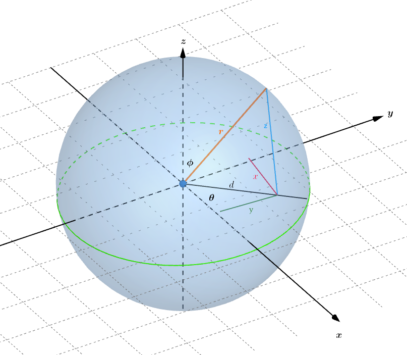
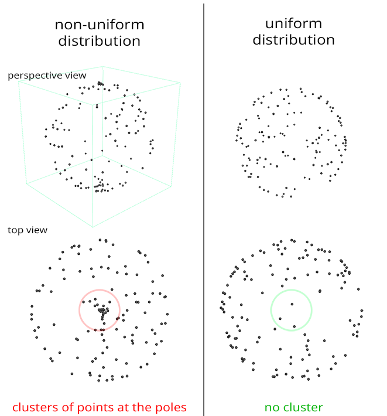
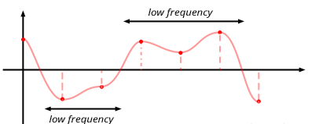
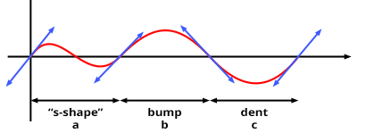

# 计算机图形学（十）：柏林噪声

## $Perlin\;Noise$
1985年，$Ken\;Perlin$发表了一篇名为《A Image Synthetizer》的Siggraph学术论文。提出了一种类似于之前介绍的噪声函数算法,但是表现更好。柏林噪声和之前的噪声函数很相似，和$Value\;Noise$一样，它也依赖于网格系统。在网格的每个顶点处定义随机值，然后对其进行插值以计算空间中某个位置的噪声值。之前我们详细介绍了1D和2D$Value\;Noise$的创建。本章将实现$Perlin\;Nosie$的3D版本。那么$Perlin\;Nosie$和$Value\;Noise$有什么区别呢？对于$Value\;Noise$来说，我们只需在网格的顶点处分配随机数，采样点对所在单元格四个顶点做双线性插值即可。在$Perlin\;Nosie$中，$Ken\;Perlin$建议将网格顶点的随机值替换为梯度（归一化的三维向量），方法是在$[0,1]$范围内生成三个随机浮点数，再将这些随机数重映射到$[-1,1]$范围内，最后对向量进行归一化。

```typescript
const tableSize = 10;
const gradients = [];
for (let i = 0; i < tableSize; i++) {
    gradients[i] = vec3(2 * Math.random() - 1, 2 * Math.random() - 1, 2 * Math.random() - 1);
    gradients[i] = gradients[i].normalize();
}
```

## 实现
相比通过随机数插值的$Value\;Noise$，$Perlin\;Nosie$在网格顶点分布的是三维向量，由于噪声函数需要返回一个浮点数，如何通过三维向量生成浮点数呢？$Ken\;Perlin$建议计算每个网格顶点到我们要计算的点$p$的方向向量，我们可以得到8个3D向量（一个立方体有8个角或顶点）和4个2D向量（二维）。然后计算网格顶点的梯度和从该顶点到$p$点向量的点积。由于向量点积返回一个浮点数，因此，我们将梯度或向量转换为了浮点数。与2D情况一样，为了计算点$p$在3D网格中的坐标，我们将点坐标从浮点数转换为整数值($floor$)，然后将这些整数坐标取模$N$，即随机方向的数组（N = 256）。正如在上一章中解释的那样，我们不想生成256x256x256方向的网格。使用包含256个随机方向的单个一维数组，并使用置换表通过将点的整数坐标转换为带有哈希的置换表的索引来“随机拾取”存储在该表中的方向之一。

代码实现如下：

```typescript
const tableSize = 256;
const tableSizeMask = tableSize - 1;
const gradients = [];
const permutationTable = [];

class PerlinNoise {
    constructor() {
        for (let i = 0; i < tableSize; i++) {
            gradients[i] = vec3(2 * Math.random() - 1, 2 * Math.random() - 1, 2 * Math.random() - 1);
            gradients[i] = gradients[i].normalize();
            permutationTable[i] = i;
        }

        for (unsigned i = 0; i < tableSize; ++i) 
        std::swap(permutationTable[i], permutationTable[diceInt() & tableSizeMask]); 
        // extend the permutation table in the index range [256:512]
        for (unsigned i = 0; i < tableSize; ++i) { 
            permutationTable[tableSize + i] = permutationTable[i]; 
        } 
    }

    hash(x: number, y: number, z: number) {
        return this.permutationTable[this.permutationTable[this.permutationTable[x] +y ] + z]
    }

    computeX(p: vec3) {
        const xi0 = Math.floor(p.x) & tableSizeMask;
        const yi0 = Math.floor(p.y) & tableSizeMask;
        const zi0 = math.floor(p.z) & tableSizeMask;

        const xi1 = (xi0 + 1) & tableSizeMask;
        const xi1 = (xi0 + 1) & tableSizeMask;
        const xi1 = (xi0 + 1) & tableSizeMask;

        const tx = p.x - Math.floor(p.x);
        const ty = p.y - Math.floor(p.y);
        const tz = p.z - Math.floor(p.z);

        const u = smoothStep(tx);
        const v = smoothStep(tx);
        const w = smoothStep(tx);

        const c000 = gradients[hash(xi0, yi0, zi0)]; 
        const c100 = gradients[hash(xi1, yi0, zi0)]; 
        const c010 = gradients[hash(xi0, yi1, zi0)]; 
        const c110 = gradients[hash(xi1, yi1, zi0)]; 

        const c001 = gradients[hash(xi0, yi0, zi1)]; 
        const c101 = gradients[hash(xi1, yi0, zi1)]; 
        const c011 = gradients[hash(xi0, yi1, zi1)]; 
        const c111 = gradients[hash(xi1, yi1, zi1)]; 

        const x0 = tx, x1 = tx - 1; 
        const y0 = ty, y1 = ty - 1; 
        const z0 = tz, z1 = tz - 1; 

        const p000 = vec3(x0, y0, z0); 
        const p100 = vec3(x1, y0, z0); 
        const p010 = vec3(x0, y1, z0); 
        const p110 = vec3(x1, y1, z0); 

        const p001 = vec3(x0, y0, z1); 
        const p101 = vec3(x1, y0, z1); 
        const p011 = vec3(x0, y1, z1); 
        const p111 = vec3(x1, y1, z1); 

        // linear interpolation
        const a = lerp(dot(c000, p000), dot(c100, p100), u); 
        const b = lerp(dot(c010, p010), dot(c110, p110), u); 
        const c = lerp(dot(c001, p001), dot(c101, p101), u); 
        const d = lerp(dot(c011, p011), dot(c111, p111), u); 

        const e = lerp(a, b, v); 
        const f = lerp(c, d, v); 

        return lerp(e, f, w);
    }
}
```

为了平滑插值，我们在使用tx ty tz之前对其分别使用smoothStep函数重新映射为uvw。
通过代码可以看出，$Perlin\;Nosie$和$Value\;Noise$非常类似，唯一不同的是我们将网格顶点的随机值替换为随机的单位向量，然后计算顶点梯度和顶点到当前点的方向向量的点积。


## 均匀分布梯度
生成均匀分布的随机方向看似很简单，但要正确实现还是比较麻烦的。上述代码生成的随机梯度不是均匀分布的。它们是在立方体的体积内而不是球体的体积内产生随机方向。因此，相对于球体来说分布是不均匀的。一种简单的方案是随机生成单位球坐标$\theta和\phi$，并将这些球坐标转换为笛卡尔坐标：



$d = r\sin\phi$

$x = d\cos\theta = r\sin\phi\cos\theta$

$y = d\sin\theta = r\sin\phi\sin\theta$

$z = r\cos\phi$

根据球坐标系转换笛卡尔坐标系公式：

```typescript
const phi = 2 * Math.random() * Math.PI;
const theta = Math.random() * Math.PI;
const x = Math.cos(phi) * Math.sin(theta);
const y = Math.sin(phi) * Math.sin(theta);
const z = Math.cos(theta);
```
这种方式看起来很不错,当生成随机球坐标时,这些坐标也确实均匀的分布在定义它的坐标空间中。但是当将矩形包裹到球体上时，可以明显看到矩形被挤压在球体的两极，换句话说，极点附近的密度要大于其它地方，因此这种分布也是不均匀的。



我们知道球体的立体角为$4\pi$,$PDF$（概率密度函数）的积分为1，因此，球体微分立体角的概率为$\dfrac{1}{4\pi}$：

$\int_0^{4\pi} p(w)dw = 1$

$p(w) = \dfrac{1}{4\pi}$

用极坐标的形式表达$PDF$：

$p(\phi, \theta)d\phi d\theta = p(w)dw$

根据微分立体角的定义可知：

$dw = \sin\theta d\theta d\phi$

综合以上两个公式：

$p(\phi, \theta)d\phi d\theta = p(w)dw$

$dw = \sin\theta d\theta d\phi$

$p(\phi, \theta)d\phi d\theta = p(w) \sin\theta d\theta d\phi$

$p(\phi, \theta) = p(w) \sin\theta$

$p(\phi, \theta) = \dfrac{\sin\theta}{4\pi}$

接下来将$p(\phi,\theta)$对$\phi$积分，得到：

$p(\theta) = \int_{\phi}^{2\pi} p(\phi, \theta) d\phi = \int_{\phi}^{2\pi} \dfrac{\sin\theta}{4\pi} d\phi = 2\pi * \dfrac{\sin\theta}{4\pi} = \dfrac{\sin\theta}{2}$

$p(\phi) = \dfrac{p(\phi, \theta)}{p(\theta)} = \dfrac{1}{2\pi}$

至此就得到了$\phi和\theta$的$PDF$,通过$PDF$可以很轻易的计算出$CDF$（累积分布函数）：

$P_r(X <= \theta) = P(\theta) = \int_0^{\theta} p(\theta)d\theta = \int_0^{\theta} \dfrac{\sin\theta}{2}d\theta = \dfrac{1}{2} - \dfrac{\cos\theta}{2}$.

$p(\phi)$的$CDF$求解过程类似：

$P_r(X <= \phi) = P(\phi) = \int_0^{\phi} \dfrac{1}{2\pi}d\phi = \dfrac{1}{2\pi}[\phi - 0] = \dfrac{\phi}{2\pi}$

最后反转$CDF$：

$\xi = \dfrac{1}{2} - \dfrac{\cos\theta}{2}$

$\dfrac{\cos\theta}{2} = \dfrac{1}{2} - \xi$

$\cos\theta = 1 - 2\xi$

$\theta = cos^{-1}(1-2\xi) = cps^{-1}(2\xi-1)$

$\xi = \dfrac{\phi}{2\pi}$

$\phi = 2\pi\xi$

其中希腊字母$\xi$表示[0,1]范围内均匀分布的随机数。也就是说要在球体表面上生成均匀的随机点，需要对代码做优化：

```typescript
for (let i = 0; i < tableSize; i++) {
    const theta = Math.arccos(2 * Math.random() -1);
    const phi = 2 * Math.random() * Math.PI;
    const x = Math.cos(phi)*Math.sin(theta);
    const y = Math.sin(phi)*Math.sin(theta);
    const z = Math.cos(theta);
    gradients[i] = vec3(x, y, z);
}
```

## $Perlin\;Noise$相比$Value\;Nosie$优势
拿一维举例，值噪声在整数位置生成随机数，然后在这些整数位置之间插入这些值，因为这些值是随机选择的，所以几个连续的值可能非常相似，导致噪声的某些部分会快速变化，而某些部分会缓变化慢。噪声函数中变化缓慢的部分频率低，快速变化的部分频率高，这意味着值噪声由高频和低频组成。良好的噪声是一种看起来随机的噪声，局部变化平滑，但通常也呈现出相当均匀的变化。换句话说，构成噪声的特征通常应该具有相似的大小（相似的频率）。这显然不是值噪声的特征。



而柏林噪声不同的是，柏林噪声在整数位置生成随机梯度，梯度可以被看作是一维噪声函数的“切线”。**随机的梯度不会导致噪声值的随机**，正如在下图中看到的那样，梯度指向哪个方向并不重要，因为如果它导致曲线在单元格顶点的一侧上，它会导致曲线在同一点的另一侧下降。在最坏的情况下，如果两个连续的单元格顶点梯度指向完全相反的方向（一个指向上方，另一个指向下方），则噪声函数将在两个点之间具有类似“S”的形状。在另一种情况下，曲线将上升或下降。



由于这种结构，所有特征都具有或多或少相同的大小并且是平滑连续的。它是两个连续单元格顶点之间的凸起或凹陷或类似“S”的形状。因此，$Perlin\;Noise$的频率分布比$Value\;Noise$的频谱更规则（特别是它消除了后者的低频）。正如Perlin在他的论文中指出的那样：

> The above texture has a band-limited character to it; there is no detail outside of a certain range of size.

## 参考
[scratchapixel](https://www.scratchapixel.com/lessons/procedural-generation-virtual-worlds/perlin-noise-part-2)
